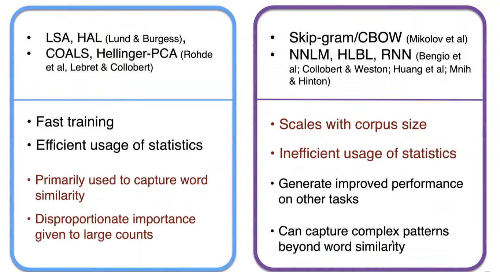
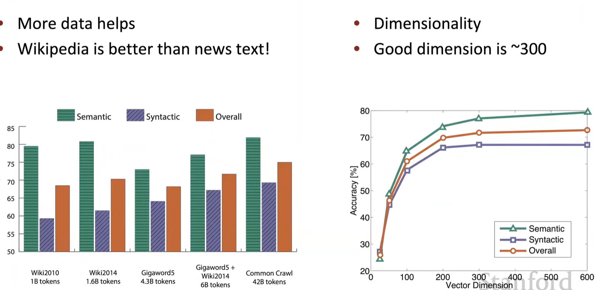
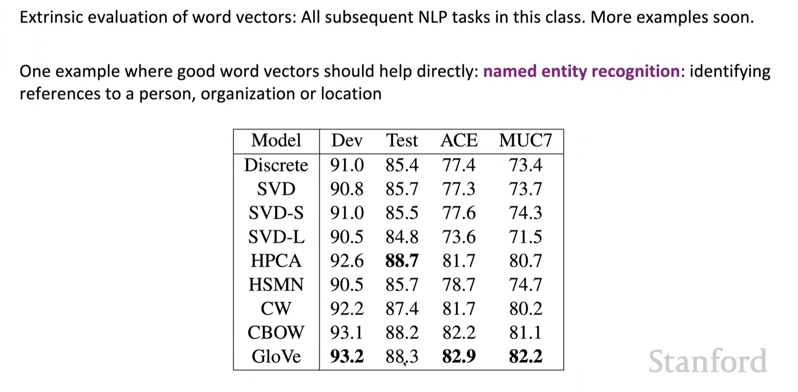

# Lecture 2

After the introduction of word2vec，this lecture is about the part of <b>Optimization</b>

### 1. Gradient Descent
- so as said, there is a cost function $J(\theta)$ to be minimized, by calculating the gradient of $J(\theta)$ and moving $\theta$ in small steps to the direction of the gradient
- $\theta^{new} = \theta^{old} - \alpha \nabla_{\theta} J(\theta)$ 
- $\alpha$ is the learning rate/step size, which is a hyperparameter
- $\nabla$ is the gradient

### 2. Stochastic Gradient Descent (SGD)
- obviously, the $J(\theta)$ in the gradient calculation is too massive, so for a single update, it would take a lot of time
- so this **SGD** method, repeatedly takes small window size with **less center words**, and update the $\theta$ parameters in the same way
- **does a better job, and also in a quicker time**

### 3. Negative Sampling (skip Gram model)
- In **Softmax** the **denominator for the norm** consists of the huge sum of all the words in the vocabulary, which is very costly to compute

#### Regression (side quest)

&nbsp;&nbsp;&nbsp;&nbsp;&nbsp;&nbsp;&nbsp;&nbsp;&nbsp;&nbsp;&nbsp;&nbsp;&nbsp;&nbsp;&nbsp;&nbsp;**Linear regression:** is training a model in a form of $y = wx + b$, where w is the weight, and b is the bias, and learns w and b to predict y as close as possible to the real value of y
&nbsp;&nbsp;&nbsp;&nbsp;&nbsp;&nbsp;&nbsp;&nbsp;&nbsp;&nbsp;&nbsp;&nbsp;&nbsp;&nbsp;&nbsp;&nbsp;**Logistic regression:** here the trained model predicts the probability of y, which is in the form of $y = \frac{1}{1 + e^{-wx}}$ using a sigmoid.
- so in the Skip Gram model, it uses logistic regression. And is trained in a way such that it uses a **true pair versus a noise pair**, ( pair consists of a center word and a context word, and noise refers to a random context word for the same center word). so it gives the probability if it is true pair then P = 1, else P = 0, it is a **classifier**
- $J_t(\theta) = log(\sigma(u_o^Tv_c)) + \Sigma^k_{i=1}E_{j \space in P(w)}[log(\sigma(-u_j^Tv_c))]$
- $\sigma$ as the sigmoid/logistic function, so the goal is to minimize the cost, here which means maximizing $\sigma$ in which when the input dot product is large to infinity, output of $\sigma$ is 1, and $log1 = 0$, similarly for noise pairs, the dot product should have negative infinity, and putting it into $\sigma(--inf)$ also gives out 0, so 0 + 0 = 0, (maximized).cuz everything else is negative.
- and negating works due to the sigmoid function is symmetric around 0.5
- And again, we are taking the **negative log likelihood**, because before 0 was max, still maximizing, but we want to minimize the cost function.
- $J_{neg-sample}(\theta) = -log(\sigma(u_o^Tv_c)) - \Sigma^k_{i=1}E_{j \space in P(w)}[log(\sigma(-u_j^Tv_c))]$
- maximize real pair, minimize random pair

### 4. Co-Occurence Matrix $\not ={}$ Word2vec
- it is a symmetric matrix, depending on the window size, it places the number of occurences of a word in the context window of another center word. like row for context, column for center word.
- **Reducing dimension on Co-occurence Matrix:** By decomposing the matrix through **SVD**, getting n singular values, 
- Stores most information in a smaller number of dimensions.
- **Problems:** for processing the values:
  - As running raw counts on SVD, it wouldnt work well
- **Fix:**
  - make the maximum limit of 100
  -  we can log the frequencies
  - also remove the frequently occuring function words like "the/he/has"
  - so you get more useful word vectors

#### Comparisons, introducing GloVe
**LHS uses Linear algebra**
**RHS uses gradient neural models**

- skip gram lacks statistics , because it only looks a one word at a time, unlike the co-occurence matrix which looks at the whole window
### 5. GloVe 
##### Meaning Components: words co-occuring with eachother
- level of co-occurence represented with the **ratio of probabilities**.
- for example **ice to solid** rather than gas
- 
- so here, you can see that ice and steam is **both similar** to water, so the ratio is ~ 1, nice!! however for both random words to ice and steam with **no correlation**, the ratio is also ~1
- So for plotting we would normally try to find one that is related but the other one is not.
#### Capturing the ratio:
- using a log bilinear model
- The GloVe model takes both the co-occuring and neural model's proprties. (count based & dot product learning)
  - 
  - the bilinear model is just the defining the dot product to be the log of the ratio of the probabilities
  - For the **loss function** $X_{ij}$ is form the co-occurence matrix, how many times the context j appeared in the window of center word i
  - so then, the model needs to adjust the weight and biases so for every pair $(i, j)$, you want the model's prediction $w_i^\top \tilde{w}_j + b_i + \tilde{b}_j$ to be close to the "target" value $\log X_{ij}$.
  - $f(X_{ij})$ is for scaling the words that are more common
  
- **Intrinsic way of evaluation**: (局部子任务做起)
  - evaluate directly on a specific subtask
  - helps to understand the system
  - fast
  - not clear if there is correlation established between the real task
- **Extrinsic way of evaluation**:（全局的任务）
  - evaluate on a specific task (whole)
  - long time to evaluate
  - Unclear if the subsystem has problems
### 6. Results

**On extrinsic task - In a real NLP task**

- **Extra:** words with multi meaning are made into multiple word vectors.
- and when computing they are made into 1 single vector through linear combination of the multi meaning vectors.
- however they could be seperated again due to the high dimensionality of the vectors and how sparse the vectors are.