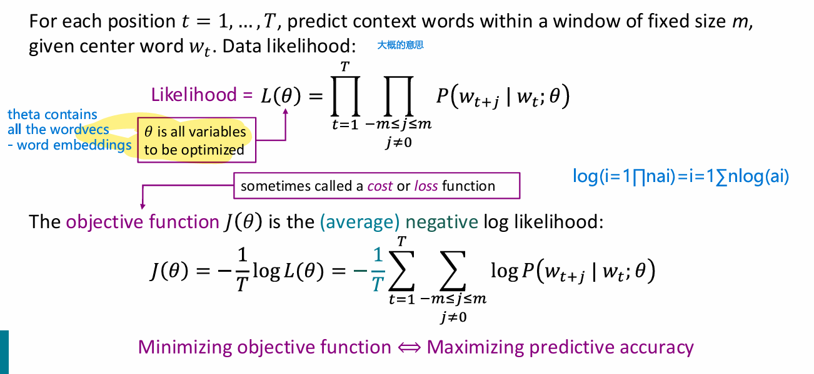

## Assignment 1

我做的是CS224N 2025秋季
总体来说第一个assignment还是挺容易的，就是配置浪费了好多时间，要注意的就是：
- 用Anaconda配置默认的python版本是3.13, 就是下载时也没有任何让你修改版本的选项，然后这导致的就是import 的 gensim数据库无法导入，因为python 3.13不兼容，需降级到3.12. 
- 我去谷歌到处搜别人做过的作业，发现好像就2025 Manning 教授才开始使用gensim库。这里降级的操作可以参考这位博主的方法：https://blog.csdn.net/szial/article/details/147540541
- 虽然整体都不难，但是第一个assignment所让我接触到对于我来说很新颖的东西。这个assignment的主旨就是利用庞大文字段落创建word vector
- wordvector：就是要把每一个单词作为主单词依次枚举，然后看周围一定半径内出现的其他单词次数。这就可以造出一个n*n矩阵
- 随后再用TruncatedSVD库来调用线性代数中SVD算法来对这个矩阵进行压缩
- 最后使用matplotlib,来根据每个wordvec 的坐标在一个二维坐标系下标注他们位置，由于之前算过每个单词周围出现的单词的概率，所以不同的单词周围出现的其他单词若相似度很高，这样，用法、即意义相似的单词就会聚集在一起
- 下面即是作业中算出word vector 后用matplotlib 点出的graph
- 

---

 

# Lecture 1

### Beginning of the lecture
- Word2Vecs: are a way of representing words as vectors
  - it contains of a <b>center word</b> and a <b>context window</b> which are the surrounding words of the center word, thus giving a plot for a n-dimensional diagram, enabling us to see similar words being grouped together
  - Word vectors, also refered as <u> word embeddings</u> 演示中为4到5维的，实际上使用300多维的向量
  - 

#### Likelihood functions
- 
  - The first Likelihood function coming from that j being index for the context words, so the first product sum representing the probability for a single center word with all the context word
  - Then, t, representing the center word, so the other product sum representing for looping all the center words, and the size of the context window being from -m to m
  - Additionally, we would like to maximize the likelihood function, which is the same as **minimizing the negative log likelihood function - the cost function $J(\theta)$**
  - And we would like to maximize the likelihood because the model needs to consistently gives h**igh probability to the real context words** that appear around each center word.
  - 
  - and the P function itself, is a **softmax function**
  - One word, has **2 corresponding word vecs**, one for the center word, and one for the context word
  - $u^T_ov_c$ dot product resembling similarity, and exponentiation (positive) and normalizing to image it to 0 to 1 to make it a probability.
  - the $J(\theta)$ also refers to the **cost/loss function**, because it shows how bad the model's prediction is compared to what we want
  - however, is inefficient due to the need of calculating all the expectancies (dot products) for every single word each and every time for the denominator
---
### But the dimensions are too large?!
##### the range is 2 * d * V!!, so there is a need of gradient
- so taking the partial derivative of the $J(\theta)$ function in terms of $v_c$ so optimizing it can predict its context words better
- ..简单的偏导计算，略
- ends up in = **observed - expected** which is exactly what we need to minimize, and the gradient refers to the direction of the steepest ascent
