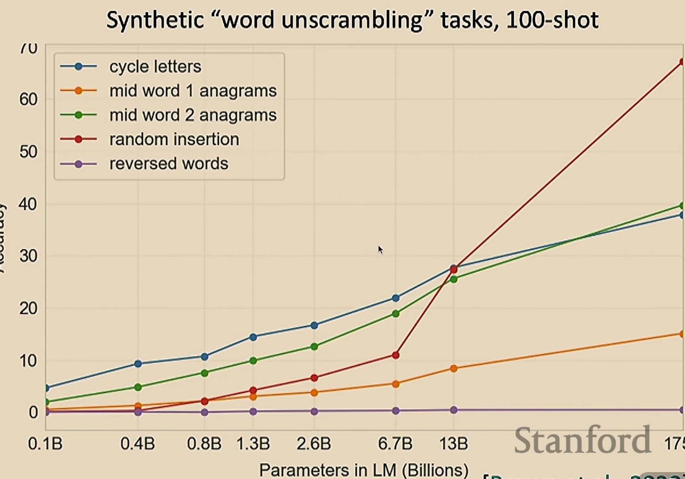
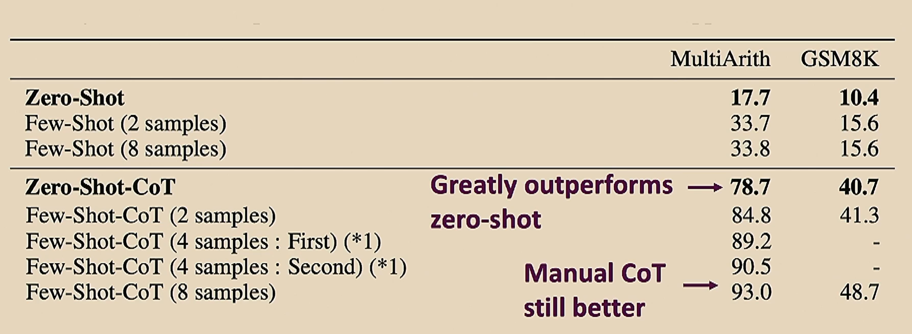
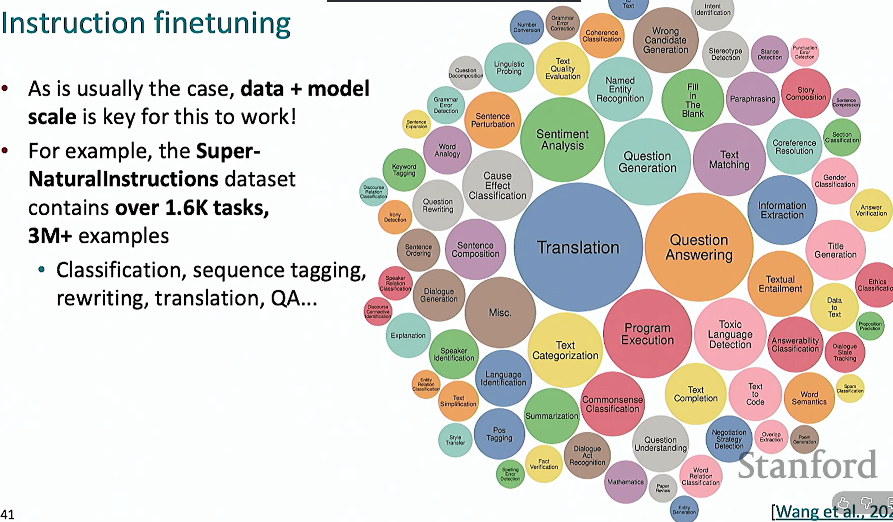
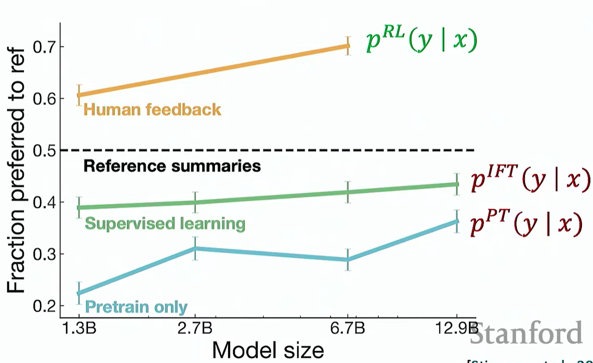

# Lecture 10

note: this lecture notes are from the spring 2024 lecture, because on the schedule i found it to be covering more recent algos that are used. (DPO)

**World Models:** its a model of how it changes the world/environment, when its agents are taking actions

### Post-training: From predicting 1 or 2 token, to LLM like GPT
 

### 1. Zero-shot and Few shot In context learning
- **Natural language inference task** : missed from last lecture, which is given 2 sentences and the model is supposed to give out the correlations between them.
- from GPT1 to GPT2, params from 117M to 1.5B, trained data from 4GB text to 40GB (links from reddit, webtext)
- #### zero-shot learning
  - just querying the model, letting it do tasks which it was not trained for, with no examples, and no gradient updates.
  - **we can do it by**
    - question answering, through given text.
    - classifying the probability of different sequences, like which object "it" refers to in a sentence.
  - this method used by GPT, beats the SoTA on benchmarks
 

- then GPT scaled to 175B, data of 600GB, and based on **Few shot learning**
- #### few shot learning
  - refers as **in-context learning** (ICL). Before asking the model to perform specific tasks, you provide few examples of the task. And still the same, there are **no gradient updates**
  - in terms of doing tasks, with the higher model size, few shot learning shows very good performance in tasks of doing word unscrambling.
    - 
 
 

- **Interesting point: how does the model learn through context, without updating/changing the gradient, at the same time changing its behavior**

 

- #### Chain of Thought Prompting
  - demonstrating the reasoning steps in an example for the task of solving it
   

  - #### zero-shot chain of thought prompting
    - involves prepending the answer with **lets think step by step**
  - 

 

### 2. Instruction Finetuning
- collecting lots of examples of (instruction, output) pairs across lots of tasks, and finetuning the model
- 
- **Limitations**: expensive to collect the data.
  - similarly for creative tasks, there are no right/wrong answer
  - and token level mistakes are penalized equally by the model, but different mistakes have different importance
  - the results for the instruction pair provided by the human may not be always correct, especially in complex tasks
  - 
 

### 3. Optimizing for human preferences(DPO/RLHF)
- so on a specific task, you can train the model to be more specified towards human preferences.
  - so this can be done through RL, where we assign rewards to the outcomes from the task and we optimize it
 

- #### RLHF pipeline
  - Firstly, we instruction tune a **pretrained model**, so it could be getting to completing tasks.
  - Then we train a **reward model**, in which it responds in a way like `how much would a human like/hate this response`
  - We need to optimize the policy by training against the reward model, to maximize the expectancy.
    - How to get the rewards：
      - instead of human labelling the data, we train a model simulating human preferences
    - However, human judgements are noisy
      - Solution: instead of asking for the exact number of scores, you ask for a comparison between several responses, ranking them.
  - **Optimizing the Reward model**
    - Bradley Terry comparison model
    - $$J_{RM}(\phi) = -\mathbb{E}_{(x, y^{w}, y^{l}) \sim D} \left[ \log \sigma\left( RM_\phi(x, y^{w}) - RM_\phi(x, y^{l}) \right) \right]$$
    - w represent winning sample, l represents losing, letting the model learn the good ones and the bad ones

 

- #### Optimizing the language model/policy
  - $$\mathbb{E}_{\hat{y} \sim p_\theta^{RL}(\hat{y}\mid x)}\left[RM_\phi(x, \hat{y})\right]$$
    -  this is the objective expectation that we want to optimize with the input sequence $x$, and the output sequence $\hat{y}$.
    - however, learning has wrong, inadequate responses, with given high rewards, this just leads to unevitable situations where you can't fix the model back again.
  - **Solve**
    - we can add penalty to the model when it goes too far away from its intialization
  - $$ \mathbb{E}_{\hat{y} \sim p_\theta^{RL}(\hat{y}\mid x)} \left[ RM_\phi(x, \hat{y}) - \beta \log \left( \frac{p_\theta^{RL}(\hat{y}\mid x)}{p^{PT}(\hat{y}\mid x)} \right) \right]$$
    - this refered as the **KL divergence**
    - PT refered to the pretrained model
    - and in the case of  $\space p_\theta^{RL}(\hat{y} \mid x) > p^{PT}(\hat{y} \mid x)$, where if the current RL model gives too high prob distribution to an output sequence compared to the pretrained model, then the penalty would be higher.
  - **Eventually we optimize through RL Algos** - increasing the probability of the distribution function giving higher probabilities for high reward responses, and training, updating the distribution function.... maximizing the expectancy objective
  - **Performance**
  - 
  - **FOR human Preferences based on text summaries generated through the different trained models**

 

### 4. DPO (Alternative to RLHF)
- we don't seperately learn a **reward model** anymore and we can represent it in terms of the **language model** $\space p_{\theta}$ or **policy**
- Linkage between the log proabilities from the language model with the human preferences
- **Derivations**
  - $$ \mathbb{E}_{\hat{y} \sim p_\theta^{RL}(\hat{y}\mid x)} \left[ RM_\phi(x, \hat{y}) - \beta \log \left( \frac{p_\theta^{RL}(\hat{y}\mid x)}{p^{PT}(\hat{y}\mid x)} \right) \right]$$
  - this is the closed solution (can directly see the optimum) for the equation above, it is from the boltman distribution, and Z(x) is the normalizing constant.
  - $$p^*(\hat{y} \mid x) = \frac{1}{Z(x)} p^{PT}(\hat{y} \mid x) \exp\!\left(\frac{1}{\beta} RM(x, \hat{y})\right)$$
  - rearrange
  - $$RM(x, \hat{y}) = \beta \log \frac{p^*(\hat{y} \mid x)}{p^{PT}(\hat{y} \mid x)} + \beta \log Z(x)$$
  - now, this shows that the language model implicitly defines a reward model, although it may not be the optimal one.
  - and initially the $p^{RL}$ model is just the pretrained model
  - $$RM(x, \hat{y}) = \beta \log \frac{p^{RL}_{\theta}(\hat{y} \mid x)}{p^{PT}(\hat{y} \mid x)} + \beta \log Z(x)$$
  - now we fit it back to the **Bradley-Terry reward optimization model**
  - whats magical here is that because we are computing the difference, so the partition function $Z(x)$ which is hard to compute would be cancelled out
  - $$RM_\theta(x, y^{w}) - RM_\theta(x, y^{l}) = \beta \log \frac{p_\theta^{RL}(y^{w} \mid x)}{p^{PT}(y^{w} \mid x)} - \beta \log \frac{p_\theta^{RL}(y^{l} \mid x)}{p^{PT}(y^{l} \mid x)}$$
  - leading to 
  - $$J_{\mathrm{DPO}}(\theta) = -\mathbb{E}_{(x, y^{w}, y^{l}) \sim D} \left[ \log \sigma\left( RM_\theta(x, y^{w}) - RM_\theta(x, y^{l}) \right) \right]$$

 
 
 

- **RL + modelling:**
  - still has problems of reward hacking
  - but achieved peak performance in cases like alphago, which is in closed, well-defined environments.