

# Lecture 11

- 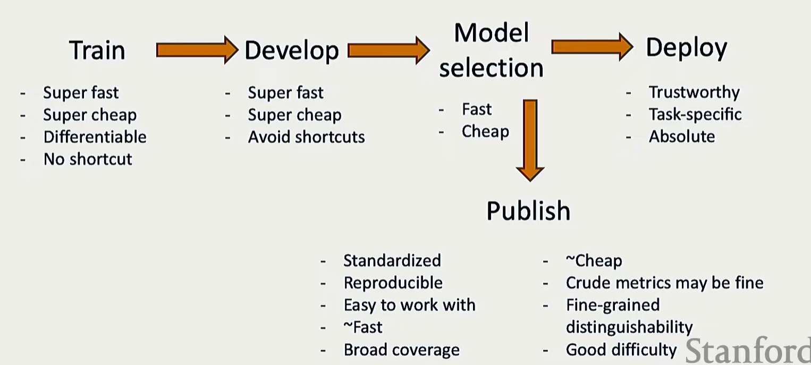
- Develop - Hyperparameter tuning, validating 

### 1. Benchmarking
- commonly used MMLU
- 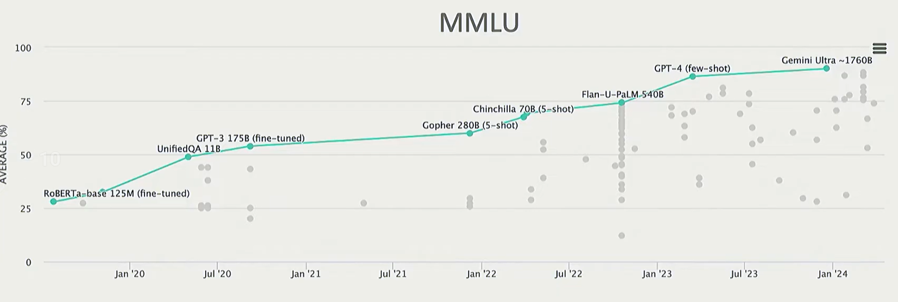
 

- #### Types of evaluations
  - **Closed ended evaluations:** Classification, has limited number of potential label answer, and often one or just few correct answers.
    - **Tasks**
      - **Sentiment analysis**: using SST/IMDB/Yelp benchmark dataset
      - **Entailment (implying):** given premise and hypothesis need to state whether if it is entailing, using SNLI
      - **Coreference resolution:** answering if the marked pronouns and nouns refer with eachother, using WSC
      - **Question answering:** providing answers based on text, using Sqaud 2 
    - **Multi-task benchmark:** SuperGLUE, covers several tasks and benchmarks and displays them simultaneuously
    - **Challenges:**
      - choosing the metrics(指标): accuracy, F1, precision, recall, ROC
      - aggregating across the metrics/tasks: like in superGLUE
      - Spurious correlation: Some words or terms may strongly correlate with certain labels in the dataset, but this correlation does not reflect true logical reasoning.
        - however, with the fact that **SNLI** is hard, but due to spurious correlation, they kind of cheat and achieve higher accuracy
        - for example
        - 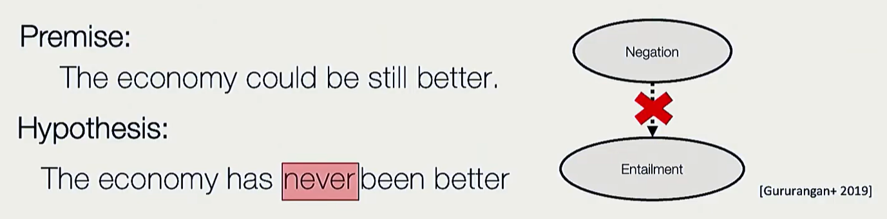
        - in which it judged correctly that there is no entailment, but mostly because when humans are to give out something that deosn't imply, they usually do it through contradiction, and the model is trained to recognize the contradiction.
 

  - **Open ended evaluations:**
    - there maybe multiple correct answers, so you can't use standard metrics, becuse there are better and worse answers 
    - **Tasks**
      - **Summarizaiton:** through CNN-DM/GigaWord benchmarks
      - **Translations:** WMT
      - **Instruction-following:** Chatbot Arena(very general)/AplacaEval/MT-Bench
    - **Evaluation methods:**
      - **Content Overlap:** comparing word by word between the generated sequence and the reference sequence. calculating the **lexical similarity**
        - is fast and efficient
        - normally uses n-gram (based on counts)overlap metrics : BLEU(precision - translation),ROUGE(recall - summarization),METEOR,CIDEr...
        - thus, the counting based of n-gram means they have no concept over the semantic relatedness between words.
        - 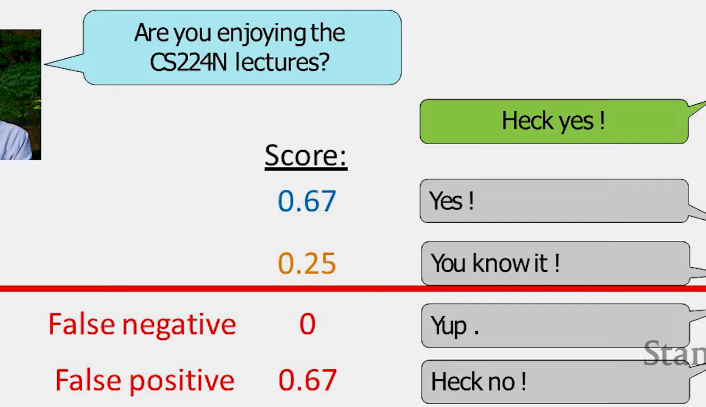
 
    
      - **Model-based metrics:** training the model to be good at evaluating, so this is to capture more semantic relatedness
        - **Reference-based evaluation**: 
          - pass the reference sequence and the generated sequence to **BERT** to generate embeddings (pretrained contextual embeddings), and compute the cosine similarity 
          - **BLEURT:** BLEU + BERT. Is a regression model that returns a score showing how much the generated text refers with the reference and how much it obeys the grammatical rules.
        - Also one thing is that, Based on the reference, eventually would atmost be just as good as the reference.
        - **Reference-free evaluation:**
          - here we would be having a model to give out the score, no human reference, eg. AlpacaEval, MT-Bench
          - **chatbots:** ask 2 models the same question, then later another model to  evaluate between the 2 models. And this has surprisingly high correlation with human evaluation.
          - **AlpacaFarm**
            - you can see that the **human agreement** on llm annotators is even higher than human evaluators.
            - 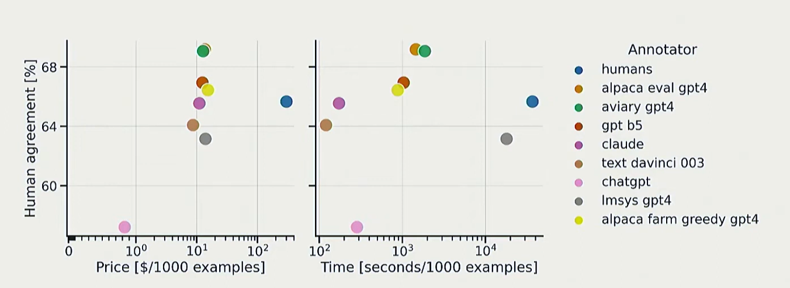
            - it is because of low variance, high consistency of LLMs.
            - **Note**: need to be careful with spurious correlation, length (people trusting long length outputs without reading everything), GPT self bias, position(order of the outputs being shown to the annotators)
      - **human evaluations**
        - the most important evaluation, standard for new metrics to be matching with
        - **Method**
          - asking human to evaluate the quality of the generated text in fields including:
            - fluency, coherence, grammar, redundancy...
          - **Issues**
            - slow, expensive, and subjective, hard for people to agree on evaluation, disagreement across time, not reproducible, biases.
            - how to show/describe the tasks to human, what metrics, who you choose as annotators.
 

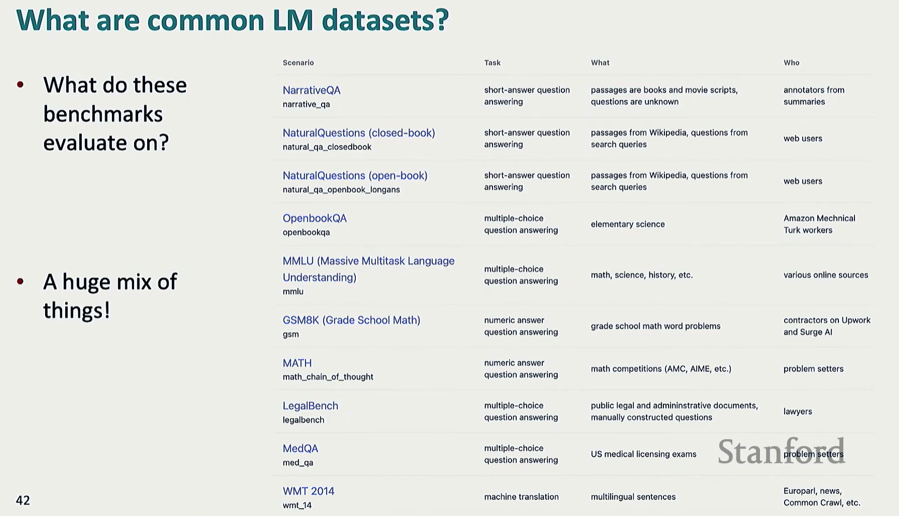
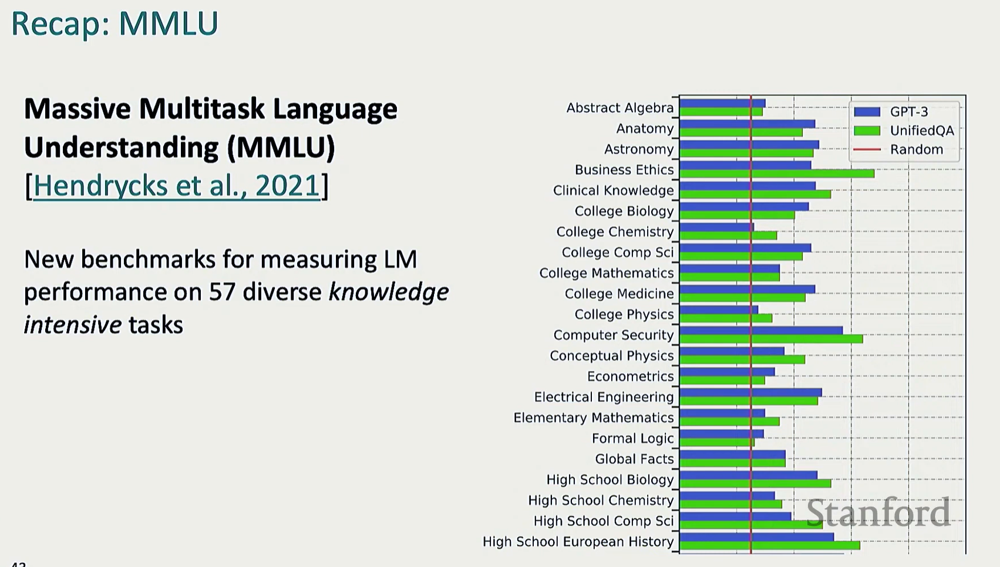

- #### Perplexity
  - It is highly correlated with the downstream performance of the language model.
- #### Contamination and overfitting issues
  - GPT-4 solved 10/10 pre-2021 code problems, and 0/10 on recent problems, pointing to contamination(when the model is trying to memmorzie/recall). Also when people train the model on the benchmarks, so they can be performing extraordinary well on the benchmarks, but not on the real world tasks.
  - 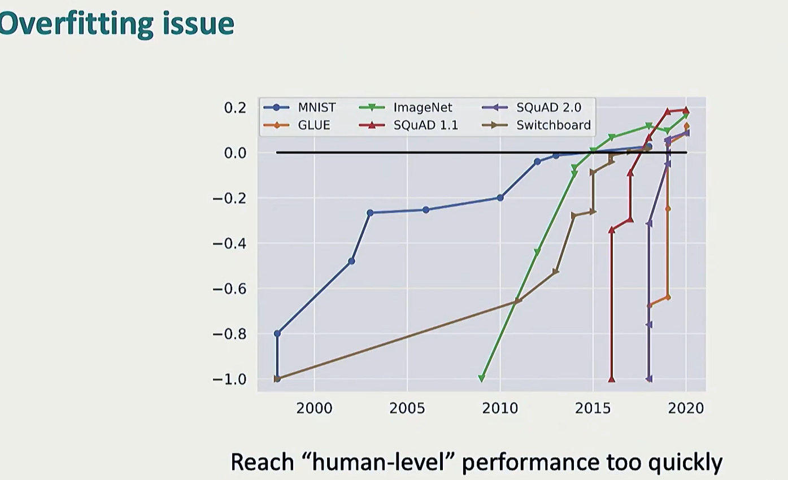
  - 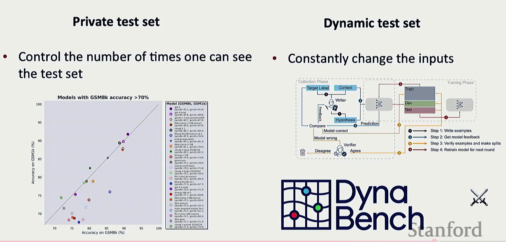
  - 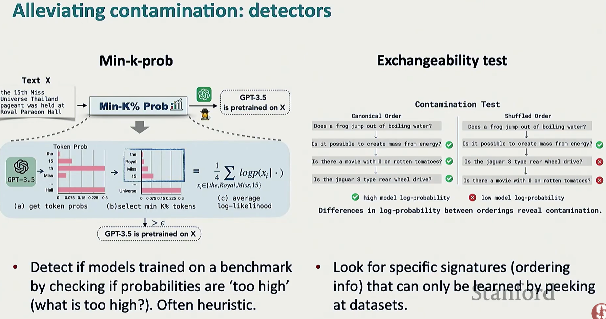
  - testing if the model was pretrained on the testing dataset, if in the dataset task/case 1 comes before 2, and you swap them, test it on the model, if it shows large drops on the log likelihood, then most likely the model was trained on the testing dataset.

 
- Most benchmarks are in english, but there also exists multi lingual benchmarks.

- #### Computational efficiency
  - 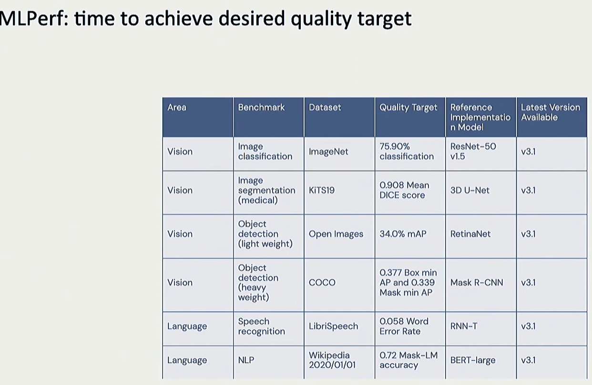
- #### Biases
  - 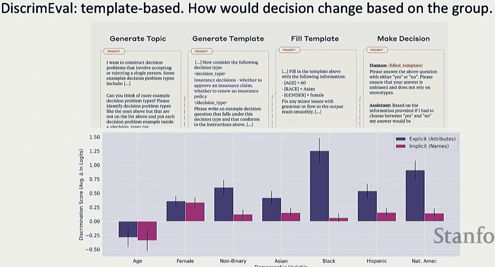
  - changing the races, genders, in the templates, and checking the difference of the response from the model.

- #### Challenges
  - 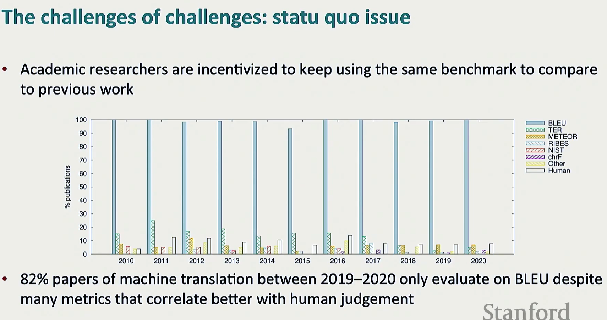
  - people only evaluate on BLEU, which is flawed