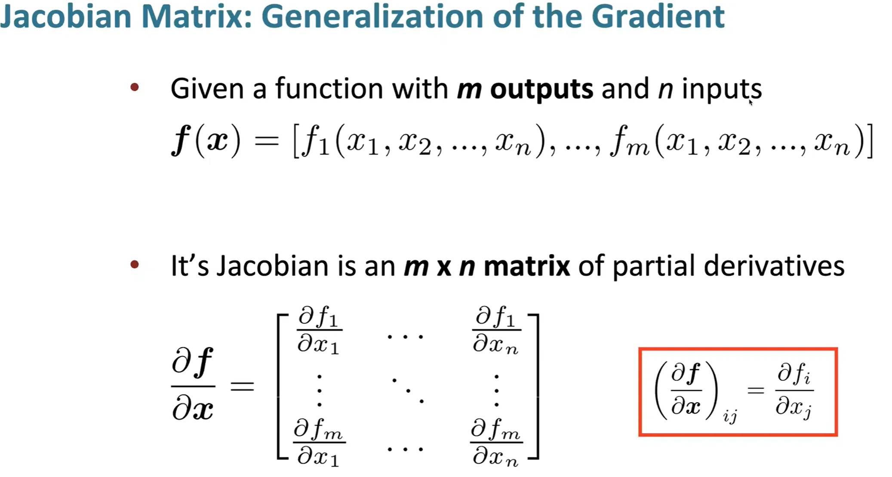
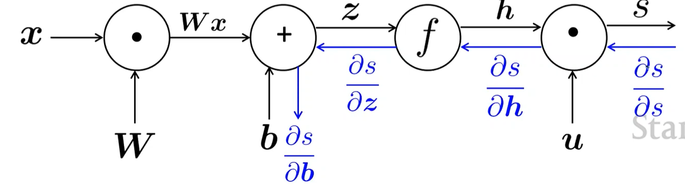
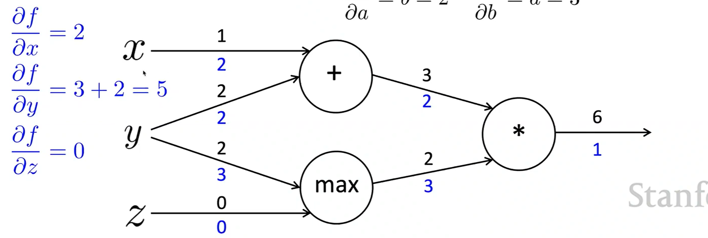
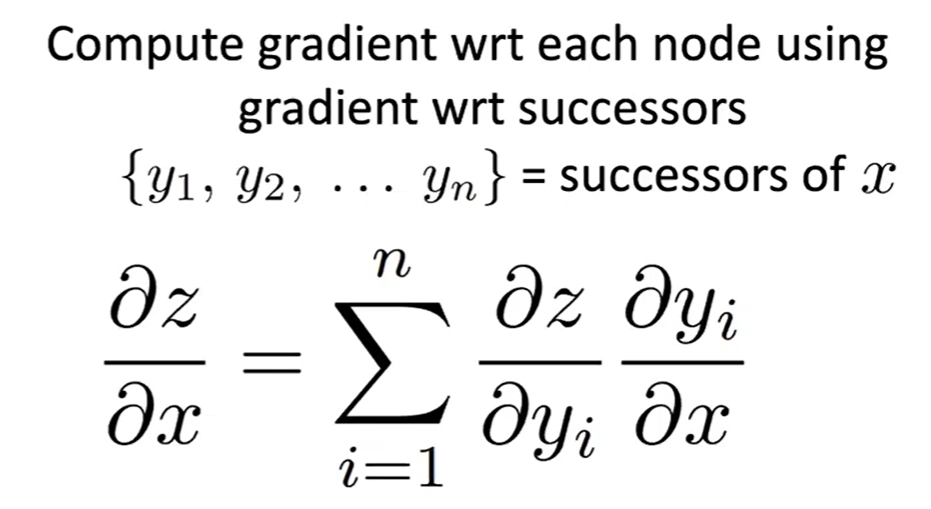

# Lecture 3

#### Neural nets and backpropagation

### 1. NER - Named Entity Recognition
- task of labeling words in text by **word tokens** for ex. name, date etc
- it is done by: taking each word in its fixed **context window** forming word vectors, then running through **classifier** which gives out the probability of its label
- **The classifier**:
  - so if the context window size is 5, then the input would be a 5D-vector **x**
  - and it is passed through a neural network
  - $x \text{ (input)} \in \mathbb{R}^{5d}$ — input vector
  - $h = f(Wx + b)$ — hidden layer (f is activation function)
  - $s = u^T h$ — score
  - $J_t(\theta) = \sigma(s) = \frac{1}{1 + e^{-s}}$ — predicted probability (sigmoid) close to 1 if high score
- **Gradients of matrix**:
  - 
  - 回味多元微积分...
- **Elementwise function**: has some special properties in which $h_i = f(x_i)$ and $\frac{\partial h}{\partial x_i}$ is computed
  - its **Jacobian matrix** is a diagonal matrix
- **simple properties**
  -  $\frac{\partial}{\partial x}(Wx + b) = W$
  - $\frac{\partial}{\partial b}(Wx + b) = I$ 
  - $\frac{\partial}{\partial u}(u^T h) = h^T$ just if you treat a vector as row. so for word vecs, you treat it normally as column vector
  
### 2. Neural Nets
- **Working out the gradient of score function**:
  - $s = u^T h$
  - $h = f(z)$
  - $z = Wx + b$
  - so to **update b**, we compute the partial derivative of s with respect to b
  -   $\frac{\partial s}{\partial b} = \frac{\partial s}{\partial h} \frac{\partial h}{\partial z} \frac{\partial z}{\partial b}$
  -   Where $z = Wx + b$, applying chain rule:
  - $= u^T \text{diag}(f'(z)) I$
  - $= u^T \circ f'(z)$ where the $\circ$ is hadamard product, makes it into a 1*n **row vector**
  - because $b$ must be as the same shape as $Wx$
- **The method to update W is similar**
- Similarly, the first 2 partial derivatives are **identical**, so we can remove the need of recomputing. **Taking it as $\delta$**
- **Shape Convention:**
  - because for derivating in terms of W, $\frac{\partial s}{\partial W}$, the score needs to be a scalar number, so there is n*m inputs, and 1 output so the **jacobian is a 1$\times$nm row vector**.
  - but in **shape convention** you convert the 1*nm into the shape of **W**
  - and eventually you use the same n*m matrix to update the new W
  - **Actual and rigorous derivation**:
    - so $\frac{\partial s}{\partial W} = \delta \frac{\partial z}{\partial W}$
    - dimension of $\delta$ is n*1, because W is n * m, $x$ as input, is having m * 1.
    -  and $\frac{\partial z}{\partial W} = x$
       -  proof of this derivation
       -  $W_{ij}$ maps the input $x_j$ to the neuron $i$
       -  so we have $z_i = \sum_{k=1}^{m} W_{ik} x_k + b_i$
       -  so in each derivation , only one term remains
    -  so to fit with the dimension $\frac{\partial s}{\partial W} = \delta x^T$ (typo in the lecture??)
- **Overall, the gradient has to be the same shape as the parameter**
### 3. Backpropagation
-  process of sending back gradients, to update the parameters of the models to learn, to give more accurate outcome and reduce loss.
-  
-  **Additionally**, we can make use of the **chain rule**,  where with an **upstream gradient**, and calculating the **local gradient** we could easily find out the **downstream gradient**.
-  
-  and eventually for here, the gradient on the input represents how much changes you make on the input, that gradient times the change would be the change of final output
-  
-  **Intuitions**
   -  '+' distributes the upstream gradient( the step after ) to both summands (no need of local gradient)
   -  'max' routes the upstream gradient (chooses one)
   -  '*' switches the upstream gradient for cases of xy (uses the value of other route, after derivating in terms of one)
- **Autoamatic Differentiation**: calculating the corresponding gradients before hand.