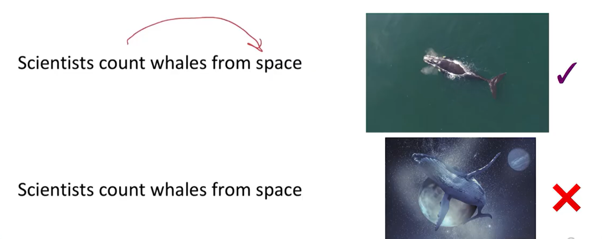
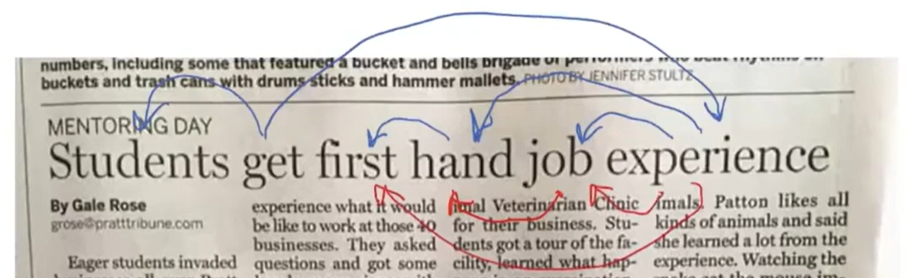
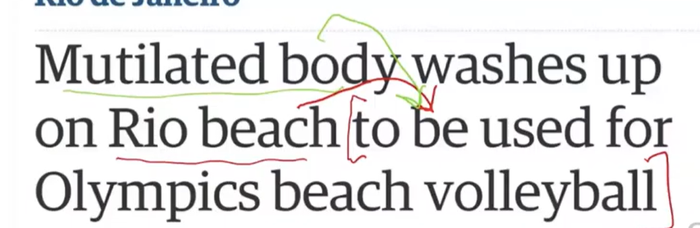
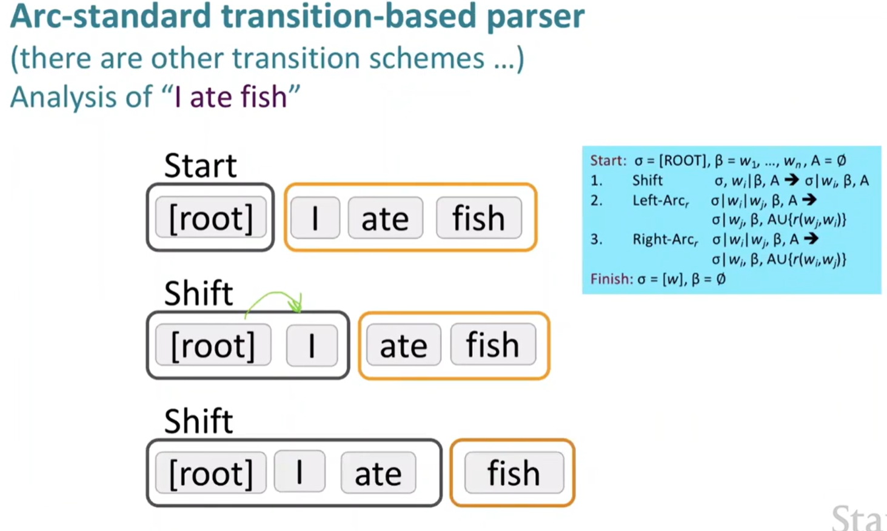
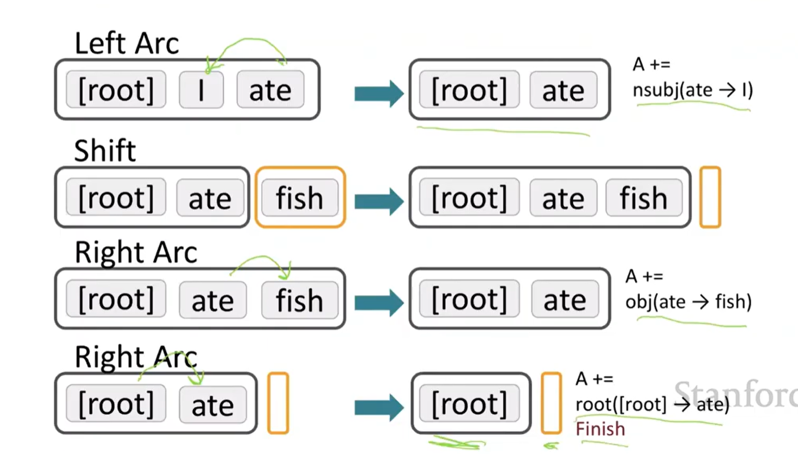

# Lecture 4

### 1. 2 views of Linguisitc structures
- #### View 1 - CFG!!
  - relating actual sentences with CFGs in such a way for ex with **verb/noun/adj as variables**,connected through grammar rules, and the **actual words as terminals**
- #### View 2 - Dependency structure
  - it shows all the words which modify/depend on other words
  - for ex. look in the kitchen.  "the" depends on "kitchen"
  - **Prepositional phrases** can cause ambiguity if you don't correctly identify what it modifies
    - A prepositional phrase (PP) is a chunk of words that starts with a preposition (like in, on, at, under, with, to, from, for)
    - 
    - need to identify what "from space (PP)" modifies
    - with **K** number of Prepositional pharase, there are $Cat(n)$ number of parse structures, ways of explaining the dependency structure
  - **Coordination scope ambiguity**: comes from how you intepret the sentence, like if you put a comma/and/or in the sentence, it changes the meaning.
  - **Adjectival/Adverbial Modifier ambiguity**:
    - 
    - HAHAHHA
  - **Verb Phrase attatchment ambiguity:**
    - 
  - **Convention:** we take the arrow as the head pointing to the dependent(the word depending on the head)
### 2. Dependency Parsing
- **Constructing**
  - 1. we choose for each word what words it depends on
  - 2. then we choose the **Root** of the dependency tree, where it doesn't depend on any other words
  - 3. we don't want the occurence of cycles.
- **Projectivity parsing:** means that when the words are in their original linear order, there are no crossing between arcs of the dependency arrows
  - And Dependency corresponding to a CFG Tree must be **Projective**
- **Methods:** of building dependency Parsers
  - through Dynamic Programming, through $O(n^3)$
  - through Graph Algorithms
  - through Minimum spanning tree (最小生成树)
  - **Transition-based parsing:**
    - it is a greedy method. takes the method of **bottom-up** actions (starting from small pieces and building up), 
    - And consists of 
      - A stack $\sigma$ , top at right, with pushed Root initially
      - Buffer $\beta$, at the top left, starts with the input sentence
      - A set of **Dependency arcs A**, starts empty
      - And a set of actions includes like {Shift, Left-Arc, Right=Arc}
    - So the algo ends when $\sigma = ROOT$ and $\beta = \emptyset$
    - Example
    - 
    - 
    - So how to predict the next action?
      - Answer is ML, use neural nets to train classifier to predict the next action