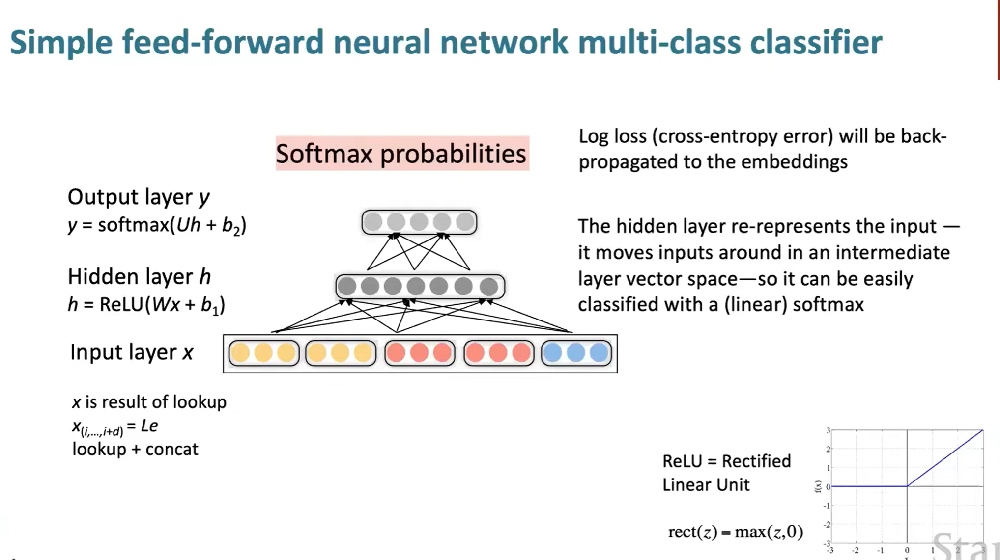
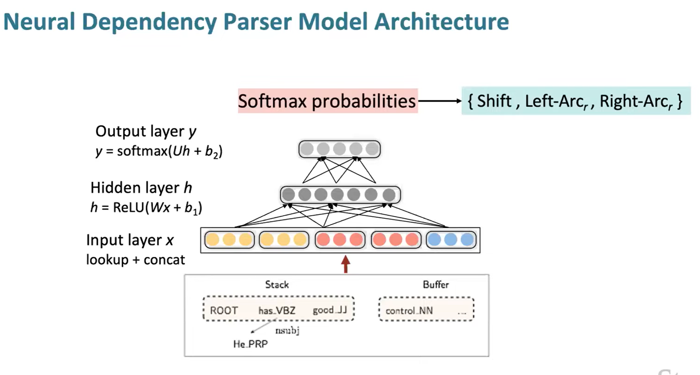
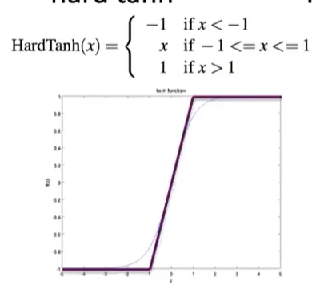
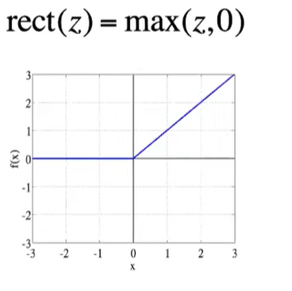
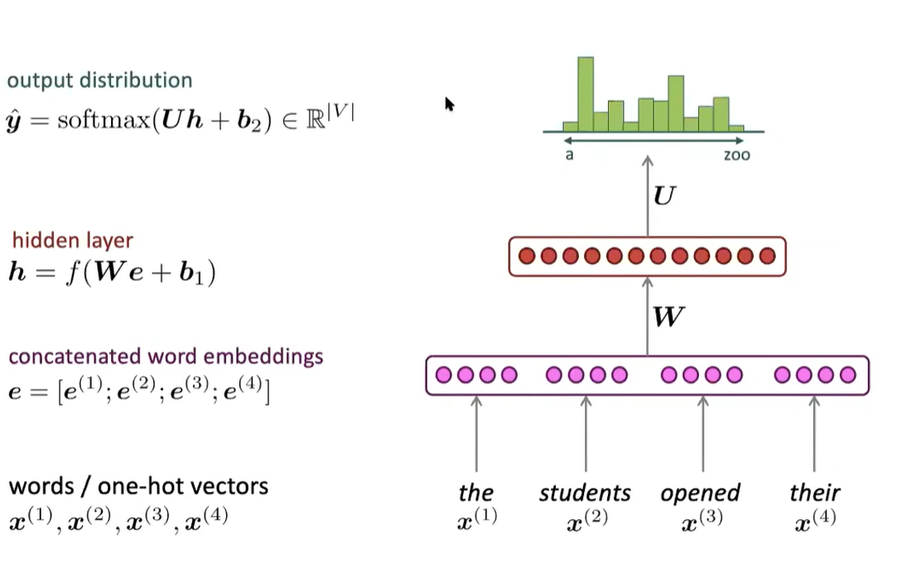
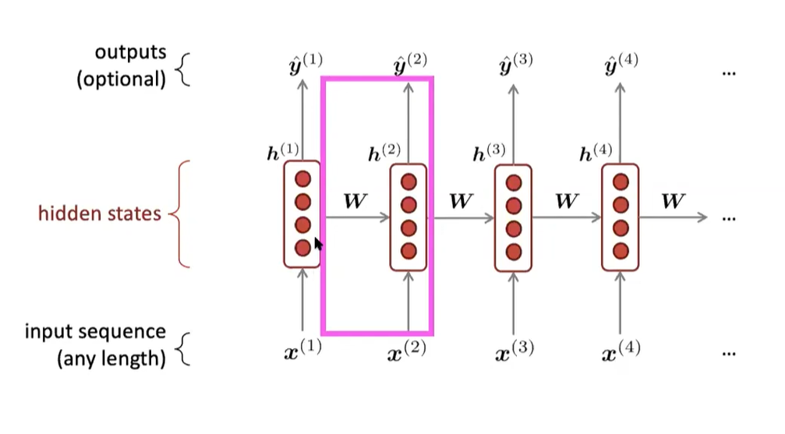
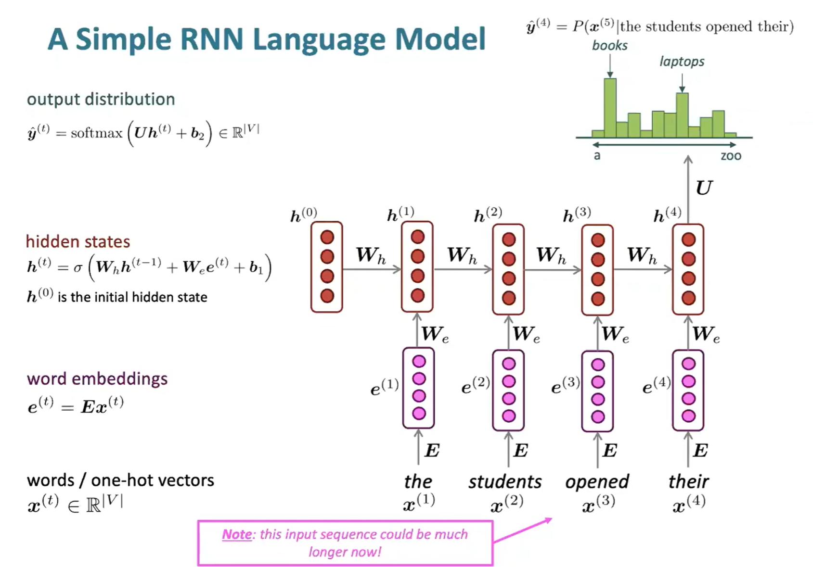

# Lecture 5

nsubj - nominal subject
det - determines

### 1. Neural Dependency Parser 
- **Distributed Representations:** making use of word embeddings with d-dimnesional dense vector for each word.
  - while **Part-of-speech tags (POS) (Noun/Verb/Adj...)**  and **dependency labels (the ones marked over the arcs like root/nsubj/obj/det...)** are also represented as vectors
  - then these concatenate, forming a single vector, represents the neural configuration
- **Using non linear Deep learning Classifiers:**
  - using **SoftMax classifier**, then training the weight matrix W, to minimize negative log likelihood.
  - 提供非线性划分
  - 
    - multi-class classifier means that choosing 1 label out of k possible ones
    - look up + concat means the embedding process for the words and POS, involves multiplication(by lookup/embedding) which a one-hot vector representing which words and POS is converted to a dense vector which is fed into the input layer
 
- Applying the Neural Net architechture to the **transitional based parser**:
  - 

### 2. More about Neural Nets
- **1. Regularization:** used when there are too many paramenters, so used to prevent overfitting(training data)
  - $$J(\theta) = \frac{1}{N} \Sigma^n_{i=1} -log(\frac{e^{f_{y_i}}}{\Sigma^C_{c=1} e^{f_c}}) + \lambda\Sigma^d_{k=1} \theta_k^2$$
  - this works because, for parameters that are not useful, then it doesnt change the negative log likelihood much, then the penalty would be on the params term getting reduced to 0.
  - On the other hand if the params were useful, then the penalty would be smaller because the change of log likelihood pays for it.
  - $\lambda$ is the strength of regularization like the learning rate
- **2. Dropout:** used to prevent feature co-adaptation (not generalizing)
    - At training time, it randomly sets 50#% of the inputs to each neurons as 0
    - and at testing time, it halves the model weights
- **3. Vectorization:** running through dot prodcuct/matrix multiplication, has significant advantages in terms of time complexity compared to straight up using for loops.
- **4. Non-linearity functions:**
  - started of from the **Sigmoid function**, but it only represents positive
  - thus came the **tanh** function, which is exactly the same as Sigmoid, but ranges from -1 to 1, however there are still problems which is that exponentials are too expensive to calculate
  - after that, came **hard tanh** which is a piecewise linear approximation
    - 
  - then, came the **ReLU (Rectified linear unit)**
    - 
    - it is very simple, and can be trained very quickly because of its constant gradient.
    - and it is not a **classifier function** but an **activation function** to create non linearity
- **5. Parameter Initialization:**
  - weights initialized to small random values between a range of (-r,r) to prevent symmetric learning.The r should not be too big or too small 
  - Initiaze the hidden layer biases to 0, and the output layer biases to the optimal value as if the weights were 0.
  - **Xavier initialization:** $$
\mathrm{Var}(W_i) = \frac{2}{n_{\text{in}} + n_{\text{out}}}
$$
    - so here the Variance represents the range which you choose the initial weights and the fan-in $ n_{in}$ is the number of input units feeding into one neuron, and $n_{out}$ as the output from teh neuron, feeding to the output layer
    - and for **uniform distribution** 
    - $$\mathrm{Var}(W_{ij}) = \frac{r^2}{3}$$
- **6. Optimizers:**
  - **Stochastic Gradient Descent**
    - The models below have different learning rates according to their own weights, are **adaptive**
    - Adagrad
    - RMSprop
    - Adam
    - SparseAdam
  - **Choosing of Learning rates**
    - Can choose a constant learning rate
      - start with something like 0.001
      - trying powers of 10
    - Gradually decreasing the learning rate can give better results
      - halving the learning rate every k epochs
      - or through a formula : $lr = lr_0e^{-kt}$ for epoch t

### 3. Language Modelling and RNN
- **Language Modelling:** it computes a probability distribution of the next word to occur, given a sequence of words
  - **n-gram Language Models**
    - **n-gram** is a chunk of n consecutive words
    - First, we make a **Markov Assumption**, which the next word depends only on the current state, which the current state is the previous n-1 words (for a n-gram) $$ P(x^{(t+1)}|x^{(t)},...,x^{(1)})= \frac{Prob_{n\text{-}gram}}{Prob_{n-1\text{-}gram}} =\frac{count(x^{(t)}, x^{(t-1)}, ..., x^{(t-n+1)})}{count(x^{(t-1)}, x^{(t-2)}, ..., x^{(t-n)})}$$
    - and count is just simply the number of times the words occured **consecutively** in the corpus for the n chunk
    - **Disadvantage** is that the words before the n-1 chunk is just discarded.
    - **Sparsity Problem** for the counting, the chunk may have never occured in the corpus, if it was the numerator you could add a small $\delta$ to the count which refers as smoothing
      - however if the denominator has never occured, then you can condition the n size chunk to a smaller chunk, called **backoff**
      - normally we choose **5-gram** model.
    - **Storage Problems** also exists, because you have to store the counts of all the possible chunks
  - **Neural Language models:**
    - using a **fixed window**
    - 
    - **Solved**
      - Sparsity problem, as the chunks dont necessarily have to appear exactly in the corpus
      - No need to store all counts
    - **Remaining Problem**
      - Fixed window too small 
      - making the window larger also enlarges the Weight matrix
      - Positions are being modelled independently, so the original symmetry is not maintained
    - **So we need a neural architechture that can process any length input** (RNN)
 
- **RNN:**
  - 
  - So to predict the next word, it uses the current $x^{(t)}$ together with the hidden state $h^{(t-1)}$ multiplied with the matrix $W$,and then forming the current hiddent state $ h^{(t)}$ then passed to the next laye.This is a recursive structure so all of the input is considered.
  - **Overall Structure**
  - 
  - so more accurately, the current embedding is commputed with the previous hidden state and the bias to form the current hidden state and in the end the final hidden state passed to the softmax function to produce the probability distribution.
    - **Advantages**
      - Can process any length, because the hidden state size is fixed no matter how further you proceeed
      - same weights applied on each step, so there is a symmetry on how inputs are processed
    - **Disadvantages**
      - Computation is slow
      - Hard to access information from many steps back(what transformer does)