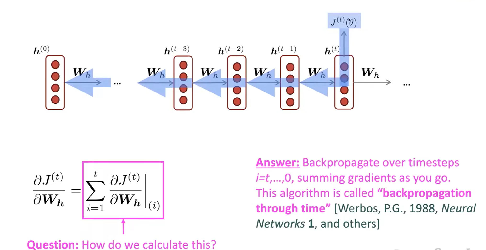
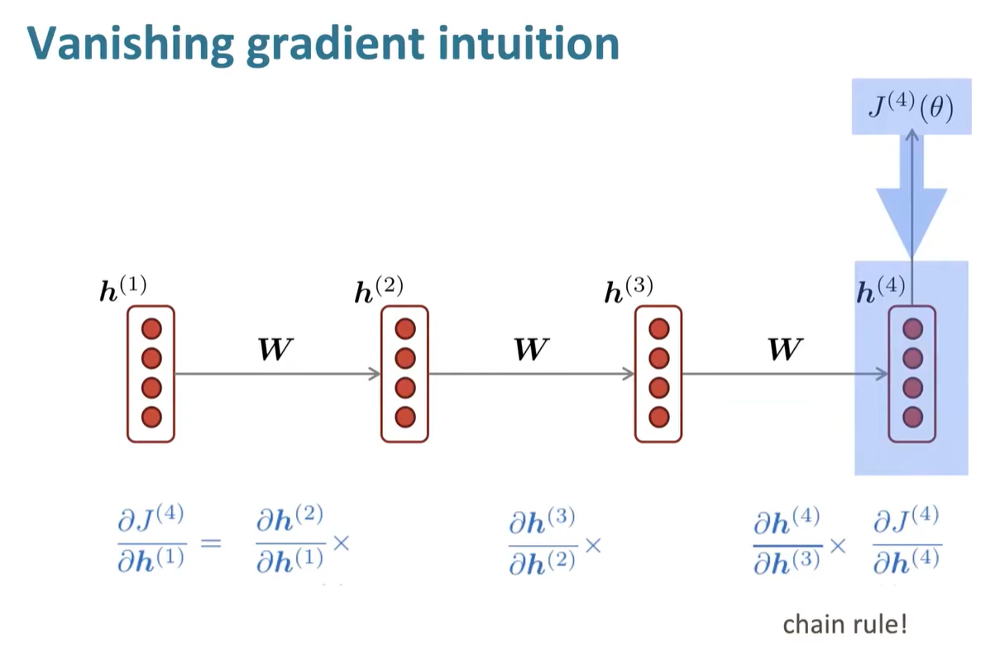
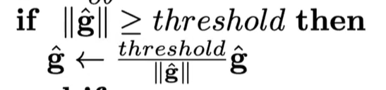
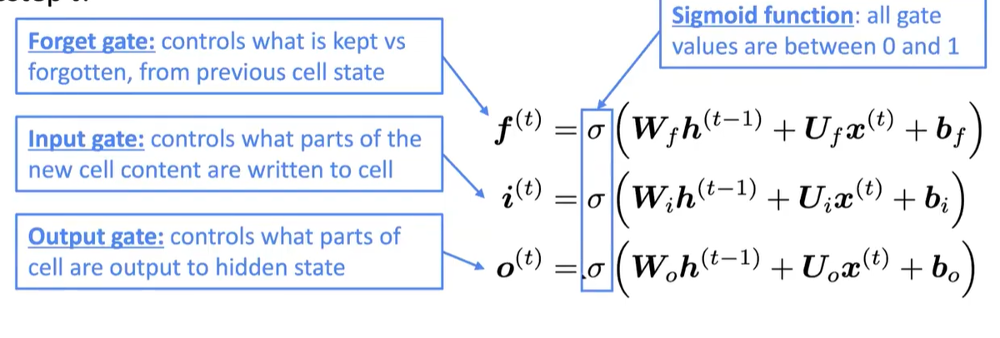
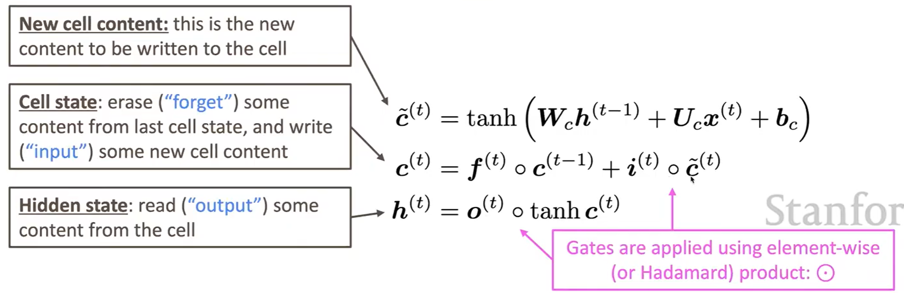
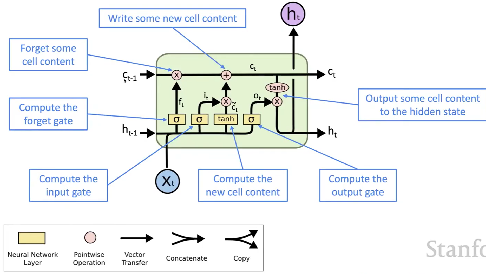
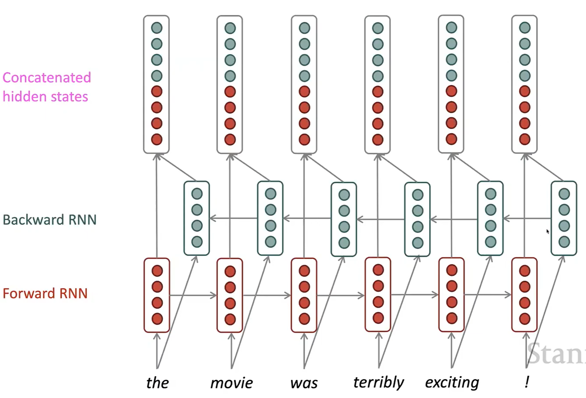

# Lecture 6

### 1. Training an RNN Model
- **Loss function**
    - So we start off with a big corpus of text, which is a **sequence** of words, then we feed the sequence into the **RNN-Model** as shown in the last lecture note
    - With that, then at each step, the model tries to predict the next word using all the previous information (prefixes)
    - Then as the **actual next word** is known, so we can calculate the **loss** with respect to the next word with the highest probability distribution, here we use a **Cross entropy loss**. 
    - **$$loss \space function \space on \space step \space t$$**
    - $$
    J^{(t)}(\theta) = \mathrm{CE}\bigl(y^{(t)}, \hat{y}^{(t)}\bigr)
    = -\sum_{w\in V} y^{(t)}_{w} \log \hat{y}^{(t)}_{w}
    = -\log \hat{y}^{(t)}_{x_{t+1}}
    $$
    - where $y^{(t)}$ is the one-hot vector of the actual next word, $\hat{y}^{(t)}$ is the predicted probability distribution of the next word, $x_{t+1}$ is the actual next word
    - !!**These are not word embeddings**, one hot vectors are converted into word embeddings before being fed into the RNN model
    - and the last part of the equation goes to single term because $y^{(t)}$ is one hot, so only one element is 1, and the rest are 0, and is at the position of the actual word $x_{t+1}$
    - **$$ overall \space loss \space function$$**
    - $$
    J(\theta)=\frac{1}{T}\sum_{t=1}^{T} J^{(t)}(\theta)
    =\frac{1}{T}\sum_{t=1}^{T} -\log \hat{y}^{(t)}_{x_{t+1}}
    $$
    - then this is taking out the average over all the loss functions for all the words in the corpus
    - But again, computing for the whole thing is **too expensive**, so we still use **SGD** where we can do it **sentence-wise**
 
- **Back-propagation on RNN model**
  - 
  - so in order to update $W_h$
  - $$
\frac{\partial J^{(t)}}{\partial W_h}
= \sum_{i=1}^{t} \left.\frac{\partial J^{(t)}}{\partial W_h}\right|_{(i)}
$$ 
  - we compute its partial derivative by summing its partial derivative at each timestep **t**, and through each derivation, you update the weight $W_h$ and keep on passing to the front.
    - **Note that** the **t** here is not equivalent to the **t** in the loss function, the **t** here is the steps inside of one loss function for one single prediction, and the one before represents different predictions with differnt loss functions
  - **Backpropagation through time**
 

- **Generating Text with RNN model** (like a n-gram model)
  - because it does by **repeated sampling** as well, where in RNN it has a full context of the previous words. So you repeatedly sample from the probability distribution for the next word based on the previous words

### 2. Evaluating Language Models
- **Perplexity**
  - **$$Perplexity = \prod^T_{t=1}(\frac{1}{P_{LM}(x^{(t +1)}| x^{(t)}, ..., x^{(1)})})^{(1/T)}$$**
  - So this metric calculates the probability given to the actual word at each position,takes inverse and multiplies them, and raise to the power of 1/T which t is the length of the text.
  - so the **higher the perplexity**, the **worse** the model is
  - And intersting thing is that the perplexity is **exponential** of the **cross entropy loss** of the language model

### 3. Vanishing and Exploding Gradients
- **Vanishing Gradient**
  - 
  - so if some of the terms in the multiplication are small, then during back propagation the value gets smaller and smaller, then that indicates parameters not changing at all.
  - Through calculations, each part of the derivative equates to the matrix $W_h$ if you consider the $\sigma$ as an Identity function, so if W_h is small, then it leads to vanishing gradient.
  - And the matrix $W_h$ is small when its eigenvalue $\lambda$ is less than 0
  - **So the problem it states** is that the parameters that are at timesteps far away, has a very small impact with eachother. **no long term effects**
  - Fix: **LSTM**
 

- **Exploding Gradients**
  - when the gradient is too big, the SGD update of the parameters is too large, so may cross over the minimum point.
  - Fix: **gradient clipping**
    - if the norm of the gradient is larger than a threshold, then we scale it down before applying it
    - 
    - smaller number in the same direction

### 4. Long Short Term Memory (LSTM)
- **LSTM structure**
  - for every step t, we have a **hidden state** $h^{(t)}$ and a **cell state** $c^{(t)}$
  - and both are vectors of length n, where the cell stores **long-term information**
  - And the LSTM can **read, erase and write** information from the cell.
  - Meanwhile, the **selection of which information is altered**, is controlled by the **gates**.
    - the gates are also of length n
    - they can be open(1) or closed(0)
    - they are dynamic, because their value depends on their current context
    - 3 different gates
    - And its own weight matrices are also learned simultaneously in the same way.
    - 
    - **updating the cell state**
    - 
    - As said in the box on the left, the second equation works by hadamard product between the input gate and the new input content, while putting hadamard product between the forget gate and the old cell state, and then adding them together. (Element-wise, position to position multiplication)
    - Visualization of the 2 sets of equations above
    - 
 

##### similarly, vanishing/exploding gradients are also problem for FFN, CNN and all neural networks.
- **ResNet residual connection** also a fix for vanishing gradients, by passing on its own identity
- **Dense connections** directly connecting all the layers to each future layer
- **Highway connections** similar to residual connection, but the passing of identity controlled by a dynamic gate

#### But still replaced by Transformer...

### 5. Bidirectional RNN

- which is simply using 2 RNNs together, which has completely different parameters, but getting an overall representation through concatenation
- used when you have the full sequence
- used on **BERT**