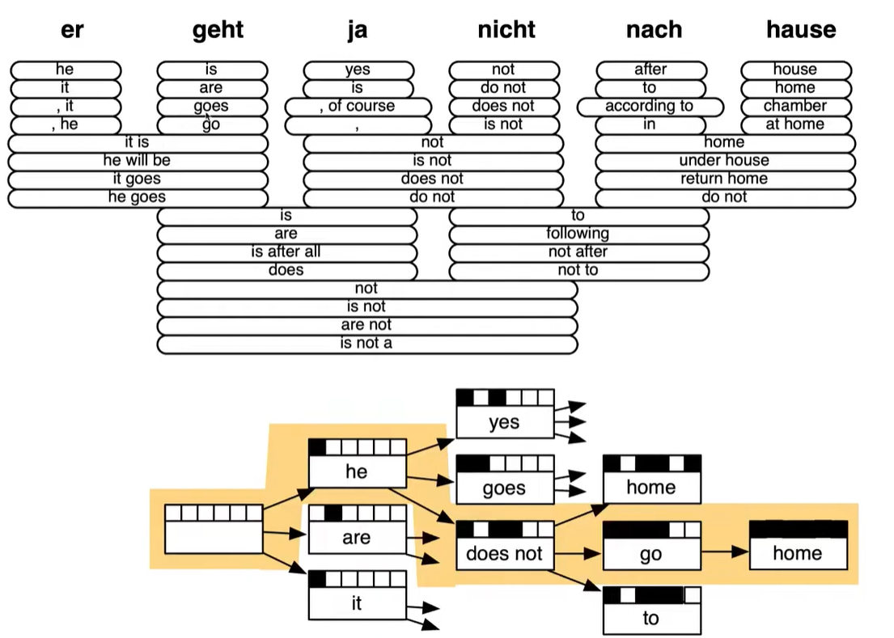
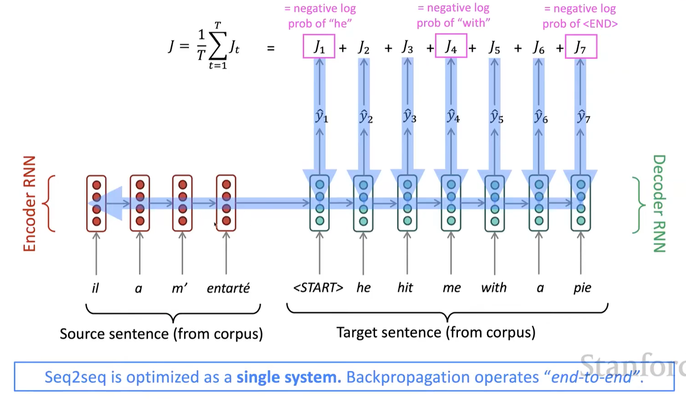
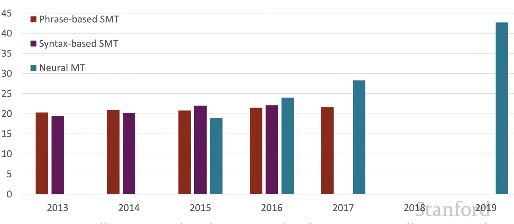
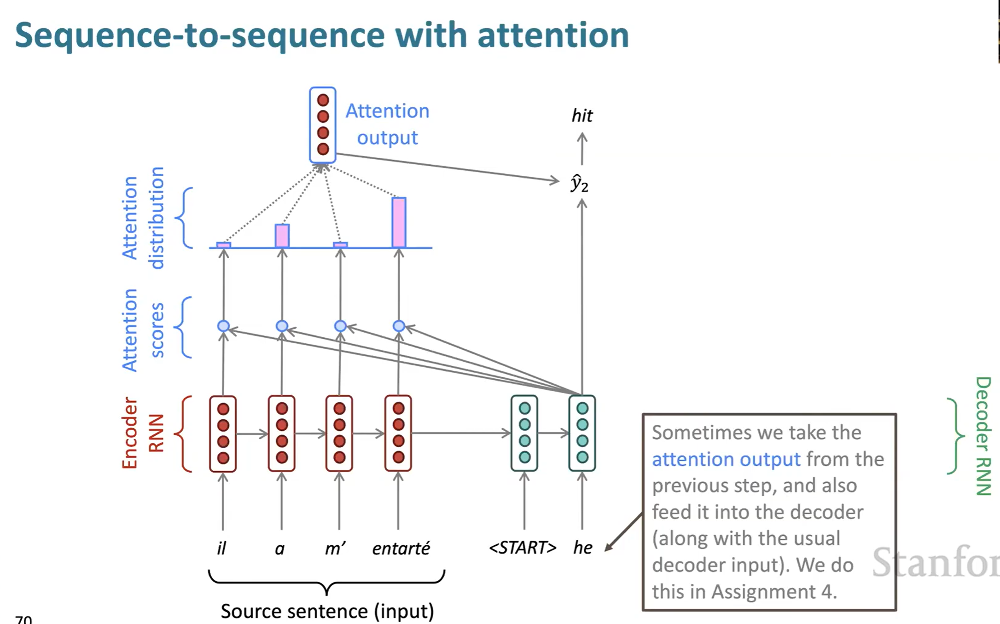

# Lecture 7

### 1. Machine Translation
- Translating a sentence x in source language to sentence y in target language
- **Statistical Machine Translation:**
  - so we try to find:
    - $$argmax_yP(y|x)$$
    - arg just means returning the sentence(object) of the probability, and given x output y
    - where we can use **Bayes rule** to break down
    - $$argmax_yP(x|y)P(y)$$
    - **Extra: Bayes Model**
      -  So intuitively, for here, refering to x, we have **E - Evidence**, which is known, so given E, we want to find the most likely **hypothesis - H** refering to y here. which is P(y|x) or P(H|E)
      -  So the Bayes model gives out $$P(H|E) = \frac{P(H)P(E|H)}{P(E)}$$
      -  this equation kind of has the intuition of using the answer to find the question, where P(E|H) is limiting down the evidence with the chosen hypthesis, then multiplying with P(H) means limiting the chosen hypothesis with its own probability, then dividing over the probability of seeing the evidence, which is P(E) because it is given, so we choose the ones over it.
   - So back to the MT, the first term **P(x|y) is the translation model**, models how words and phrases should be translated, given **x in the target language** and **how likely** is it its translation is **x in the source language (fidelity)**, and you need to learn from the **parallel data (训练样例)** of the source and target language. And the **second term P(y) is the language model**, which is the probability of seeing the target generally in english, so represents the **fluency**
    

   - **Learning of the Translation Model:**
     - We can introduce a latent variable a
     - $P(x, a|y)$ , a is an **alignment**, where it is the word to word or short phrase translation corresponding between sentence x and y
     - **Alignment** is complex, some words may not be translated. So it can be many to one or one to many.
   - **Decoding:** is the part where the arg function works, with the probability distribution, we find out the target translated sentence
     - it works by a dynamic programming process with independence assumption.
     - 
     - fill until all the boxes are filled black.
  

**Destroyed by Neural Machine translation**

- **Neural Machine Translation:**
  - here, the neural network is refered as **seq-2-seq model**, which involves 2 RNNs, one for the source language to encode, called **Encoder RNN** and one for generating the target language to deocde, called **Decoder RNN**. And both of the neural models refers to **Neural Machine Translation (NMT)**
  - seq2seq model used in many NLP tasks, such as summmarization, parsing...
  - seq2seq is a **Conditional language model** , condition refers to the predictions are also conditioned on the input sentence. (which SMT didnt do)
  - $$
P(y \mid x) = P(y_1 \mid x)\, P(y_2 \mid y_1, x)\, P(y_3 \mid y_1, y_2, x)\, \dots \, P(y_T \mid y_1, \dots, y_{T-1}, x)
$$
  - **Training NMT**
    - Still using a large corpus of parallel data.
    - 
    - generally still same as LSTM RNN training.

 

### 2. MultiLayer RNN
- by adding multiple RNNs
  - such that more complex representations could be computed
  - lower layer RNNs for low level feature, and vice versa
- also refered as **Stacked RNNs**

### 3. Greedy decoding
- just refers to the process of doing the argmax function where you take the word with the highest probability at each time step
- **Problems:** there is no chance of undoing the decisions made
- **Fix:** 
  - **Exhaustive search decoding:** which is tracking all the possible sequences at timeset t, however too slow and expesive, for a vocab of size V, it would be complexity of $O(V^T)$
  - **Beam Search Decoding:** which is tracking the top k score translations at each time step, which is complexity of $O(k^T)$  
    - and the score is calculated by $logP_{LM}(y|x)$
    - and higher the score better
    - **Stopping criteria** 
      - when reached a prefixed timestep
      - when obtained n complete hypothesis that is set 
    - Then finally out of all the hypothesis, picking the most probable one. But there is a **problem** because the probability formula depends on series of product, so the longer the sequence, the more the product, so **longer sequence may lead to lower scores**.
    - **Fix:** we can normalize the log probabilities by length (negative numbers being divided by larger numbers goes closer to 0/larger)
 
 

**Overall:** compared to SMT, NMT are more fluent, makes better use of context, better use of phase similarities.

**however** , they are less intepretable (as using a neural network), and also difficult to control, can't specify rules.

### 4. Evaluation of Machine Translation
- **BLEU score:**
  - compares the **machine-written translation** with the **human-written reference translation** and computes similarity score based on
    - n-gram (n = 1,2,3,4)
    - and a penalty for too short translation. (cuz they give high scores on probability)
    - but still imperfect

- **Eventually** problems still exists
  - out of vocab problem
  - maintaining context over long text
  - pronoun resolution errors (他 - he she him)
  - maintaining common sense
  - biases also exists.

### 5. Attention Mechanism
- Using a **direct link** between the encoder and decoder, instead of **sequential link** in RNN. So in this way you can focus on a particular part more.
- 