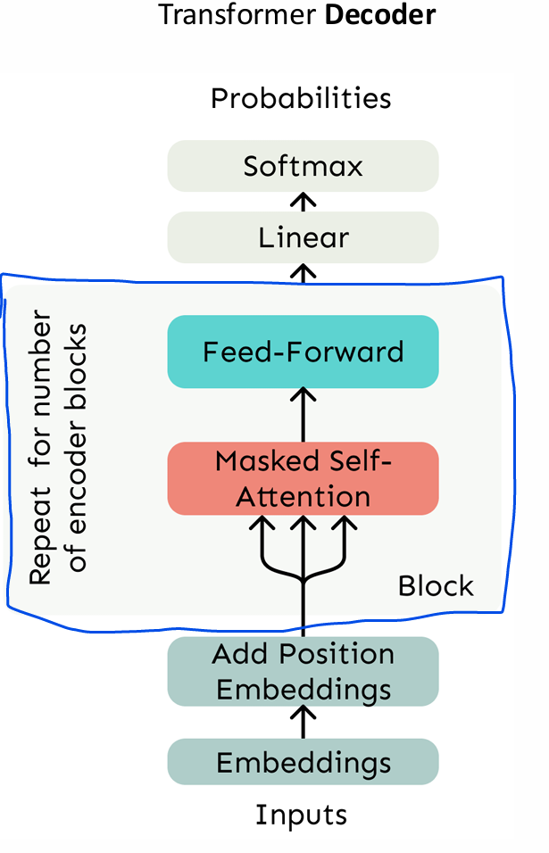
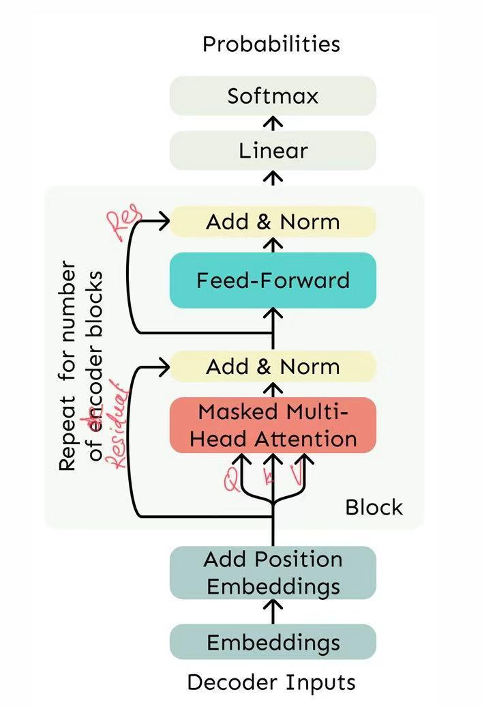
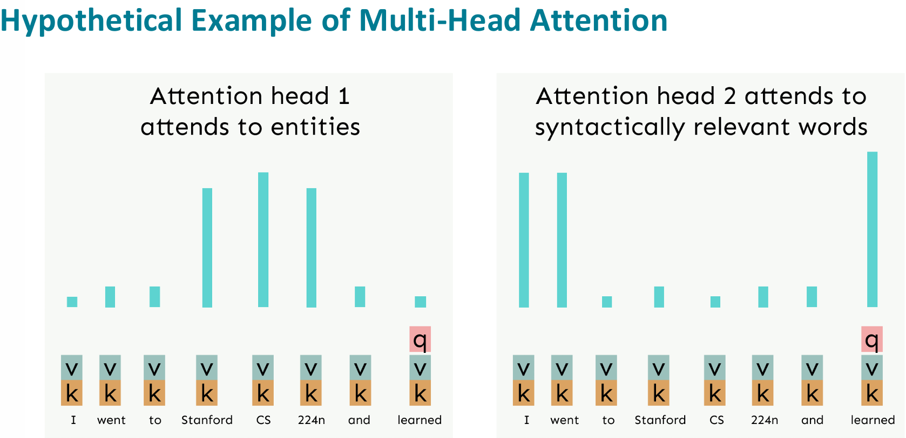
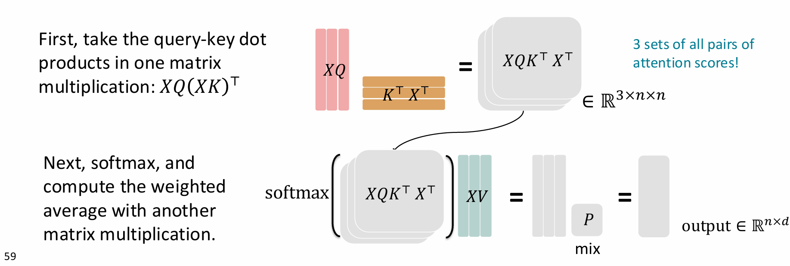
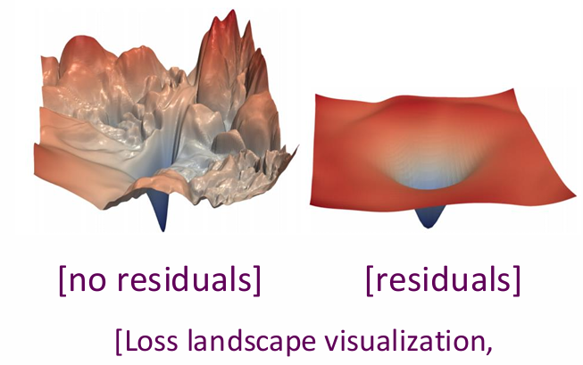
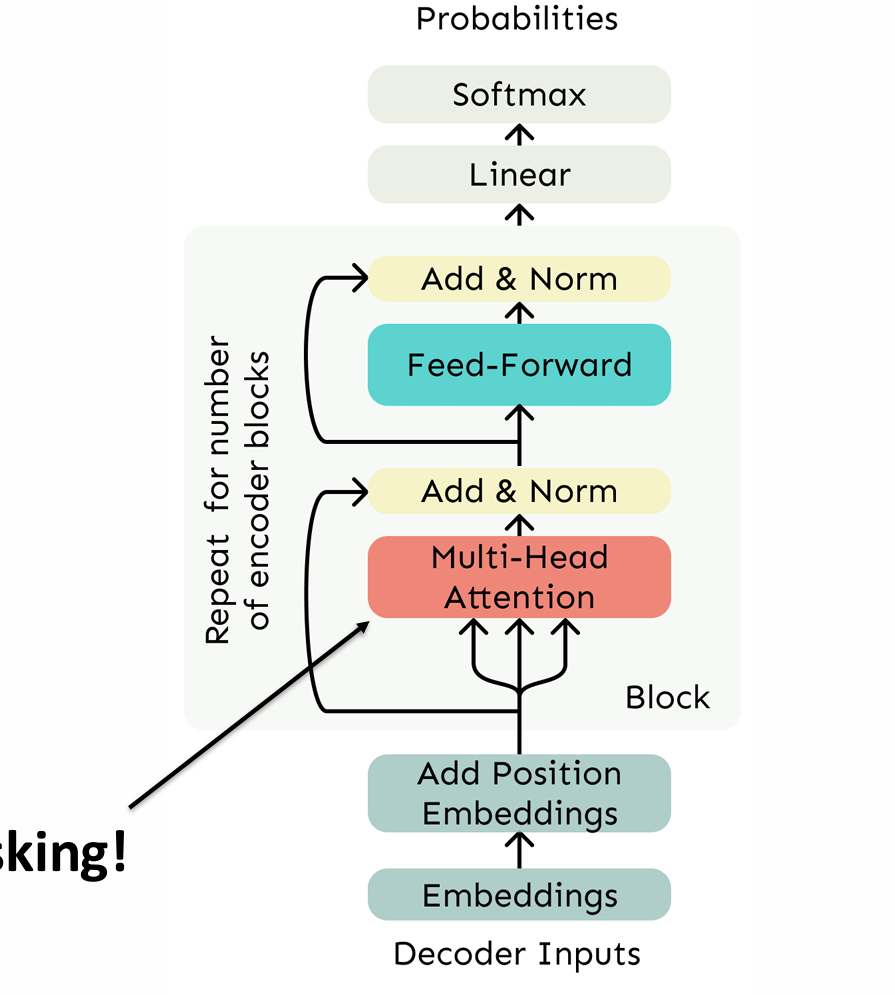
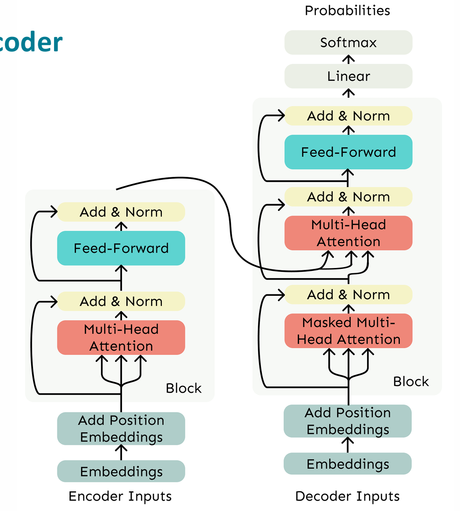
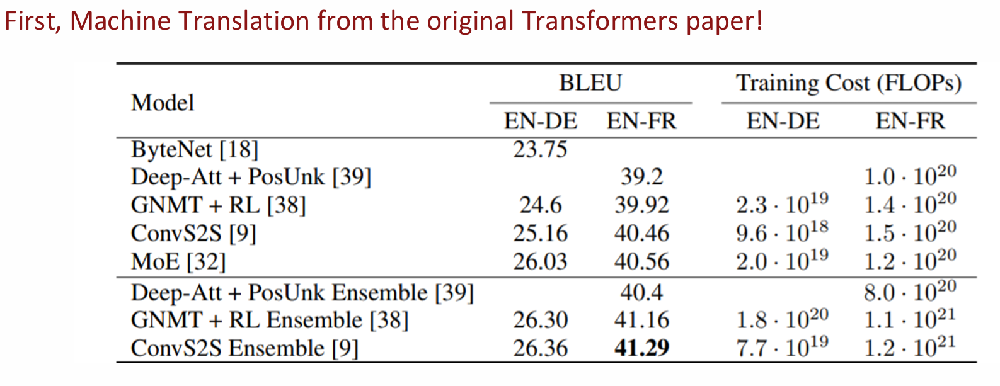
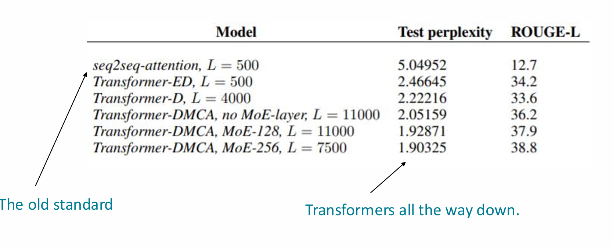

# Lecture 8

### 1. Problems with RNN
- **Linear interaction distance** still the problem with distant words, even with LSTM
- **Lack of parallelizability** have to compute sequentially, can't compute timestep 5 without computing all the 4 before it and respective hidden states.

### 2. Back to Attention
- encodes each and every word **independently** to its embeddings, so straight up solves the 2 problems stated above.
- and we can look at attention as a **lookup table**
- #### Self-Attention:
  1. Each word $w_i \in \mathbb{R}^{|V| \times 1}$ would be having its embedding through the embedding matrix $E\in \mathbb{R}^{d \times |V|}$ which is $x_i = Ew_i \in \mathbb{R}^{d \times 1}$
  2. then transformation through the weight matrices, each of them $d \times d$.  $\space \space q_i = Qx_i \space k_i = Kx_i \space v_i = Vx_i$
  3. then we can compute similarity scores through dot product, for ex. $e_{ij}  = q_i^Tk_j$. This means that while looking up word i, how much should i look at word j, when adjusting.
  4. then passing through the softmax $$\alpha_{ij} = \frac{exp(e_{ij})}{\sum_j exp(e_{ij})}$$ checking out that single j, by summing through all the js
  5. then summing out $$o_i = \sum_j \alpha_{ij}v_{j} \in \mathbb{R^{d \times 1}}$$ checking out all the js, summing the attention of all the context (j) for the query on i, then you get the representation for the word i in the context of the sequence.
 

- #### Problem 1: There is no order of sequence, so different meanings could be embedded to the same embeddings
  - **Fix**: now we consider position vectors $p_i \in \mathbb{R}^d , i\in \{1,2,3,4,...,n\}$ based on their index in the sequence, not one hot, cuz length n, dimension d
  - then we form the **position embeddings** by $\tilde{x}_i = x_i + p_i$
  - and this is performed only at the first layer
  - **representing the positional embeddings**
    - **Sinusoidal position embeddings**: 
    - $$p_i =
\begin{pmatrix}\sin\!\left(i / 10000^{\frac{2\cdot 1}{d}}\right) \\\cos\!\left(i / 10000^{\frac{2\cdot 1}{d}}\right) \\\vdots \\\sin\!\left(i / 10000^{\frac{2\cdot \frac{d}{2}}{d}}\right) \\\cos\!\left(i / 10000^{\frac{2\cdot \frac{d}{2}}{d}}\right)\end{pmatrix}$$
    - but practically this doesnt work, because it is not learnable
  - **Then we can just learn the positions!**
    - let all $p_i$ be learnable, just like other parameters, so we learn a p matrix where its columns represents the vectors.
    - **Pros** : It has flexibility, every position learns to get to fix to the data
    - **Cons**: After you learn it, you can't be representing sequence longer than the prior length.
  - **We also have**
    - Relative linear position attention
    - Dependency syntax-based position
  - **too long context still remains to be a problem** cuz matrix is fixed size
 

- #### Problem 2: Adding Non linearities to the self-attention
  - **Fix** :Using a **FFN** as used in **RNN**
  - $$m^{(i)} = W_2^{(i)} \, \mathrm{ReLU}\!\left( W_1^{(i)} \, \mathrm{output}^{(i)} + b_1^{(i)} \right) + b_2^{(i)}$$
  - **the only difference with RNN** is that it doesnt need to pass up the previous layers to **remember** anymore, only requires current layer information.
  - The FFN is applied to each word independently. Because the **initial output already considers the context**
 

- #### Problem 3: need to ensure not looking at the future when predicting
  - **Fix**: Solved through **Masking**
    - And through masking out the attention by setting future words to $-\infin$, this enables **Parallelization**
    - $$e_{i,j}=\begin{cases}q_i^{\top} k_j, & j \le i \\-\infty, & j > i\end{cases}$$
    - restrictions set while computing the output representation
- #### Self-Attention Build Block
  - 
  - should be the repeating of **Decoder** blocks, because it uses **Masked Self-Attention** to ensure no looking at the future.
 

## 3. Transformer
- #### A Transformer Decoder, upgrade on the self-attention module
  - Goal is to generate the output sequence, and while training, you use a masked attention mechanism in order to not look ahead to the training samples.
  - 
  - Replacing with **Masked Multi-head Self-Attention** 
  - 
  - Now instead of single vector forming the qkv vectors, we let $X = [x_1,x_2,...,x_n] \in \mathbb{R}^{n \times d}$ and compute $XK, XQ, XV \in \mathbb{R}^{n \times d}s$
  - and the $$ output = softmax(XQ(XK)^T)XV \in \mathbb{R}^{n \times d}$$
 

- #### Multi-head Attention
  - Allowing to look at multiple places of a sentence at once
  - $$Q_\ell,\, K_\ell,\, V_\ell \in \mathbb{R}^{d \times \frac{d}{h}}$$
  - h is the number of heads, and l ranges from 1 to h
  - so now 
  - $$\mathrm{output}_\ell=\mathrm{softmax}\!\left(X Q_\ell K_\ell^{\top} X^{\top}\right)\, X V_\ell,
\quad\text{where } \mathrm{output}_\ell \in\mathbb{R}^{n \times \frac{d}{h}}.$$
  - and the final output is the concatenation of all the outputs
  - $$\mathrm{output} = \left[ \mathrm{output}_1, \ldots, \mathrm{output}_h \right]Y \in \mathbb{R}^{n \times d/h*h * d \times d = n \times d   }$$
  - and then a linear layer is applied to the output
  - **Pros**: It is actually **Computationally effective** because we can reshape the matrices into 3 dimensional tensors.
    - First compute $XQ \in \mathbb{R^{n \times d}}$ we can decompose it into $XQ \in \mathbb{R^{n \times h \times d/h}}$
    - then Transpose it into $XQ \in \mathbb{R^{h \times n \times d/h}}$ so the head axis could act as a batch, so you can compute h out independently. Doing the same with $XK$ and $XV$
    - 
    - visualization for 3-heads
    - each head can be computed independently, more number of times repeated, but each time less computation
    - overall: $h⋅(n^2⋅d/h)=n^2d$
 

- #### Scaled Dot-Product Attention
  - It helps when the dimension gets too large, the dot product would also be too large, thus leading input to the softmax being too large(if one large and others not), approximately = 1, and for other dot products, = 0.
  - And, to update the Q, K, V matrices, we need gradient, so we calculate the partial gradient of the output in terms of the logits(dot product).
  - Then $$\frac{\partial p_i}{\partial z_j}=p_i \left( \delta_{ij} - p_j \right)$$
  - $$\delta_{ij}
=\begin{cases}1, & i = j \\0, & i \ne j.\end{cases}$$
  - so if i not equal to j, then the partial derivative $ = -p_ip_j$ and one of them should be approximately 0, leading the gradient to be 0.
  - **Fix:**
    - so we just divide the input to the dot product by $\sqrt{d/h}$, depending on the dimensionality
 

- #### Optimization Tricks
  - **Residual Connections**
    - Helps model to train better
    - $$X^{(i)} = X^{(i-1)} + \mathrm{Layer}\!\left( X^{(i-1)} \right)$$
    - so in case of vanishing gradients, it would still be 1
    - 
  - **Layer Normalization**
    - Helps the model to train faster
    - $$\mu = \frac{1}{d} \sum_{j=1}^{d} x_j\qquad \mu \in \mathbb{R}$$
    - then
    - $$\sigma = \frac{1}{d} \sum_{j=1}^{d} (x_j - \mu)^2,\qquad \sigma \in \mathbb{R}$$
    -   $$\text{output}=\frac{x - \mu}{\sqrt{\sigma + \epsilon}}* \gamma+\beta$$
    - Aim is to cut down uninformative variations
 

- #### Transformer Encoder
  - so here we want to make it bidirectional, it should be reading everything, so just **remove the mask**
  - 
  - should be encoder inputs in the bottom
  - Goal is to look at the input sequence and produce a representation of it.
  
 

- #### Transformer Encoder Decoder
  - 
  - now there is an extra **Cross attention** layer above the masked attention in the decoder
  - **Note that** the order of the 3 arrows from left to right is **K/V then Q**
  - so the **Decoder produces the queries** , and takes the **Keys and Values from the output of the Encoder**
    - this means that while generating the output, you are allowed to look at everything you have generated(masked) and the whole encoded representation of the input sequence.
  - **Cross Attention:**
    - so say $h_1, ..., h_n$ is the output vector from the encoder.
    - and $z_q, ..., z_n$ is the input vector to the decoder.
    - then we can extract $q,k,v$ by
    - $$k_i = Kh_i, \space v_i = Vh_i, \space q_i = Qz_i$$

 

### 4. Results
- #### Machine Translation
  - 
- #### Document Generation
  - 

### 5. Remaining Problems
  - **Quadratic Compute** to compute all pairs of interaction means computation growing quadratically with the sequence length. Because every token interacts with every token.
  - for **RNN** it was only **linearly**
