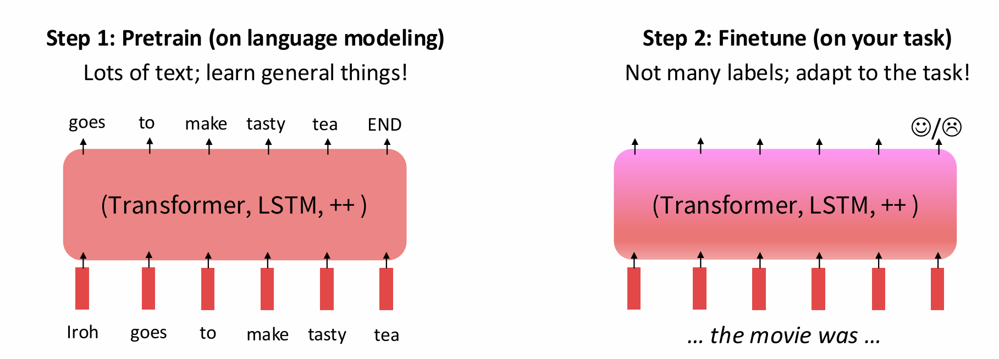
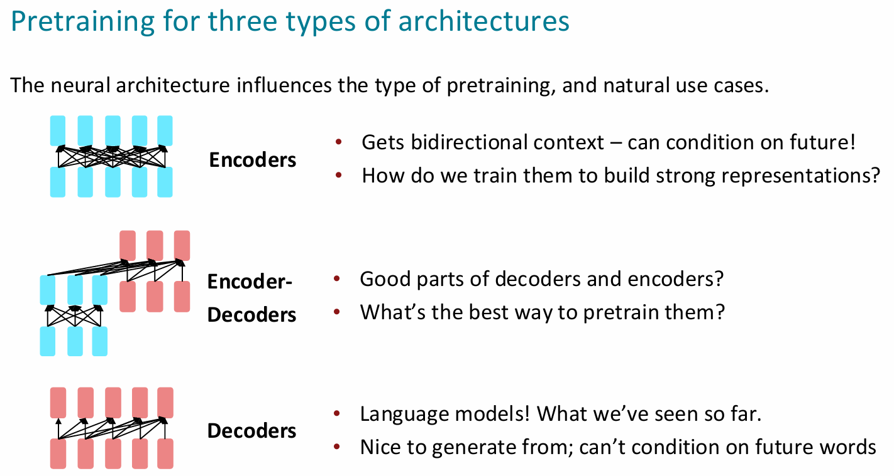
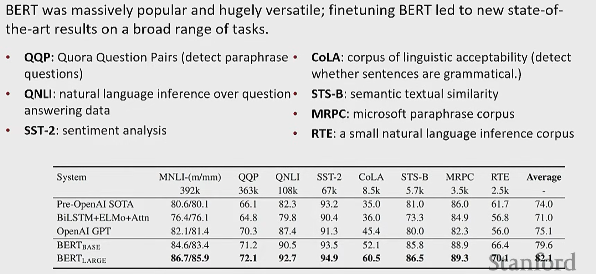
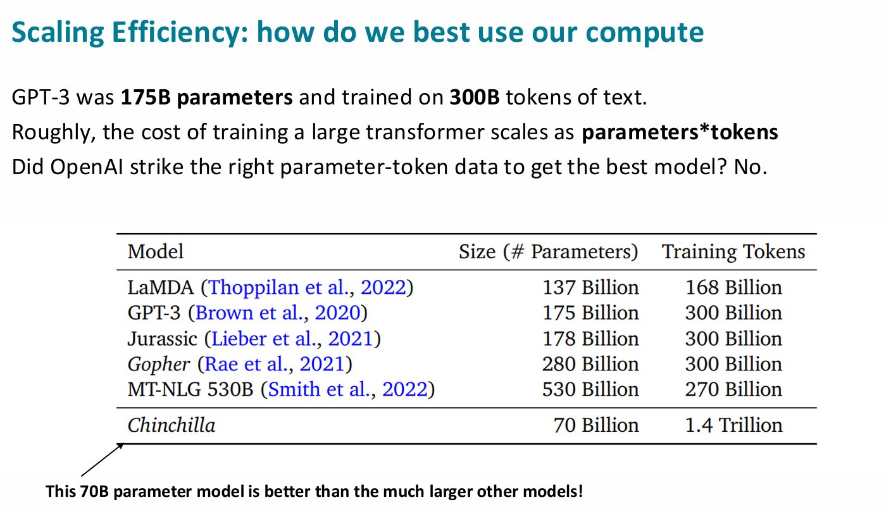

# Lecture 9

### 1. Word Structure and subword modelling
- From previous studies, we only have considered a fixed vocabulary, but for user to type in the prompts, their maybe mispellings or typos
- Similarly for a single word, there can be up to 300 conjutgations, so if we consider all of them, thats too much to learn.
- **Fix: Subword Modelling**
  - learning the vocabulary for parts of words (subword token)
  - **Byte pair encoding**
    - we start with a vocabulary only containing characters and "end-of-word" symbols (seperating words)
    - for unknown words, split them all into characters, and we find the most co-occuring adjacent characters.
    - then you replace those instances of occuring pairs with the subword.
    - and you keep doing this merging, until you reach a target vocabulary size

 

### 2. Pretraining
- **Previously** we pretrained the word embeddings (GloVe/Word2Vec), and the model is untrained (LSTM/RNN/Transformer), where their parameters are randomly initialized. Additionally no **Context** is learned. You only learn from the **downstream tasks (later given supervised data)**
- **Now** we train the **whole network** at pretraining.
  - it gives out strong representations of language
  - parameters are initialized stronger
  - strong probability distribution that we can sample from 
  - you train everything **including the corpus** together, which means it is **self-supervised**

 

- #### Pretraining through Language Modelling
  - as we learned before, it gives $p_\theta (w_t| w_{1:t-1})$ the probability of the next word given the previous words. 
  - so you train through this over large amount of text, then you **save the network parameters**
  - **Paradigm**
    - 
    - so now when you do fine-tuning, you parameters are not randomized anymore
    - similarly when you do **SGD**, you don't start from a random parameter and starting doing minimizing loss. Because it tends to stay within the basin/region near the initialization.
- Before, you just learn on downstream tasks, now you do it in fine tuning, refered to **SFT**. oooo~~

 

### 3. Model-Pretraining 3 ways
- 
- #### Encoders:
  - For **Encoders** you can train in a way such that you can Mask out fraction of the words, maintaining the bidirectional context.
    - $\tilde{x}$ is the masked version of $x$
    - learning $p_\theta (\tilde{x}|x)$
    - randomizing the masking part, then you can be learning.
    - **BERT**
      - they randomly chose 15% of the words to be predicted from the input, and for those chosen words, Mask 80% of it, and 10% replace the word with some random token, and the last 10% you keep it unchanged
      - 
    - **Limitations:** would not be considering a **pretrained encoder** for generating token tasks. Good for filling in the blanks type of tasks.
    - **Extentions** - spanBERT, where you mask out contiguous span of words.
 

- **Full fine-tuning VS Parmeter-Efficient fine-tuning (PEFT) :**
  - where full fine tuning updates all the parameters when training, and the parameter efficient fine tuning , only choose a part of the parameters to update, keeping some good generality from the pretrained parameters.
  - **2 types of Parameter-Efficient fine-tuning**
    - **Prefix Tuning, prompt tuning:** freezes all the pretrained parameters, and adds a prefix of pararmeters, then training that prefix. So in this way the old pretrained is kept, and while training only a small part is trained, not the whole gradients and optimizer states.
    - **LoRA:** freeze the weight matrix W, and difference in update AB which is very low **rank**, so overall would be W + AB

 

- #### Encoder-Decoder
  - difference here would just be the generation process is generating a full sequence like langauge modelling, and the encoder part can read the text bidirectionally.
  - **Best way to pre-train:** is to replace the original input with different length of span placeholders, and the decoder would be decoding the span out
 

- #### Decoder
  - we can fine tune a decoder through a classifier based on the previous hidden states, then calculate gradient and backpropagate. Loop
  - **pre-training** giving tasks of generating sequences with a vocabulary, just as when pretraining
  - **In current age** most used are still decoders.

### 3. Optimization
- 
  - not just about model size.
  - through CoT : refered as **In context Learning**